# aasdhajkshd_microservices
aasdhajkshd microservices repository

## Содержание:

* [docker-2 Технология контейнеризации. Введение в Docker](#hw16)
* [docker-3 Docker-образы Микросервисы](#hw17)
* [docker-4 Docker сети, docker-compose](#hw18)
* [gitlab-ci-1 Устройство Gitlab CI. Построение процесса непрерывной поставки](#hw20)
* [monitoring-1 Введение в мониторинг. Системы мониторинга.](#hw22)

## <a name="hw22">Введение в мониторинг. Системы мониторинга.</a>

#### Выполненные работы

1. Создан Docker хост в Yandex Cloud и настроено локальное окружение на работу с ним Docker хост в Yandex Cloud и инициализировано окружение Docker, выполнен запуск Prometheus в контейнере
```bash
DOCKER_MACHINE="$(yc compute instance create \
 --name docker-host \
 --zone ru-central1-a \
 --network-interface subnet-name=default-ru-central1-a,nat-ip-version=ipv4 \
 --create-boot-disk image-folder-id=standard-images,image-family=ubuntu-2204-lts,size=15 \
 --ssh-key ~/.ssh/id_rsa-appuser.pub \
 | awk '/nat:/ { getline; print $2}')"

docker-machine create \
 --driver generic \
 --generic-ip-address=$(yc compute instance list --format json | jq '.[] | select (.name == "docker-host") | .network_interfaces[0].primary_v4_address.one_to_one_nat.address' | tr -d '"') \
 --generic-ssh-user yc-user \
 --generic-ssh-key ~/.ssh/id_rsa-appuser \
 docker-host

docker-machine ls
eval $(docker-machine env docker-host)
docker run --rm -p 9090:9090 -d --name prometheus prom/prometheus
```
```output
> docker-machine ls
NAME          ACTIVE   DRIVER    STATE     URL                         SWARM   DOCKER    ERRORS
docker-host   *        generic   Running   tcp://158.160.123.87:2376           v24.0.2

> docker ps
CONTAINER ID   IMAGE             COMMAND                  CREATED         STATUS         PORTS                                       NAMES
c42e3a0e47f9   prom/prometheus   "/bin/prometheus --c…"   5 minutes ago   Up 5 minutes   0.0.0.0:9090->9090/tcp, :::9090->9090/tcp   prometheus
```
2. В корне репозитория созданы файлы monitoring/prometheus/Dockerfile и monitoring/prometheus/prometheus.yml и там же собран сам образ и образы для микросервисного приложения
```bash
export USER_NAME=23f03013e37f
docker build -t $USER_NAME/prometheus monitoring/prometheus/
for i in ui post-py comment; do cd src/$i; bash docker_build.sh; cd -; done
```
```output
$ docker images
REPOSITORY                TAG             IMAGE ID       CREATED          SIZE
23f03013e37f/prometheus   latest          0ff4f47eb4aa   8 minutes ago    112MB
23f03013e37f/ui           1.0             10ca006c2cd7   26 minutes ago   482MB
23f03013e37f/post         1.0             0c9b91c66d82   28 minutes ago   292MB
23f03013e37f/comment      1.0             3837a3a99d37   28 minutes ago   313MB
<none>                    <none>          e930e723c43c   4 hours ago      313MB
prom/prometheus           latest          9c703d373f61   2 weeks ago      245MB
mongo                     4.4.24          a701426e0e61   4 weeks ago      432MB
```
3. Добавлен сервис *prometheus*'а в *docker/docker-compose.yml* и удалены build инструкции, так как образы были собраны выше
4. Выполнен запуск сервисов
```bash
docker-compose up -d
```
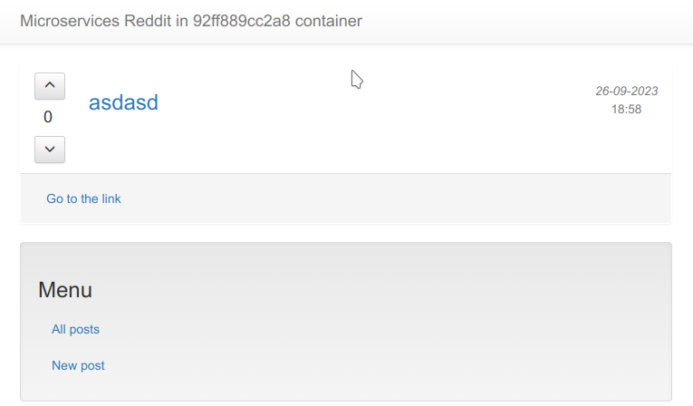

#### Мониторинг состояния микросервисов
1. Ниже список endpoint'ов
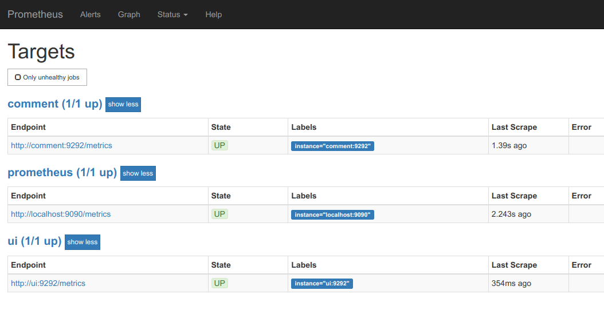
2. Проверка работы
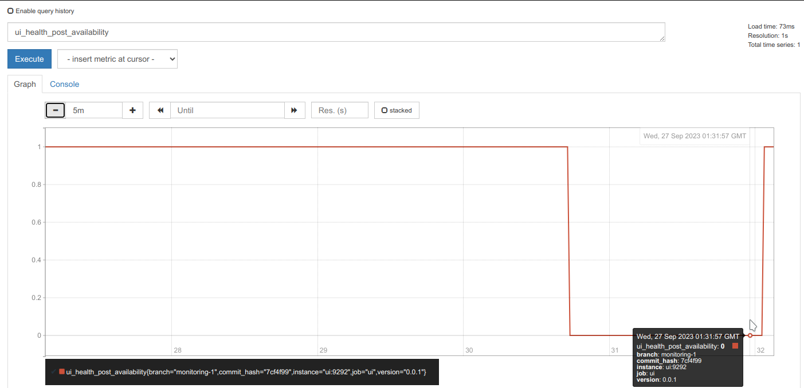

#### Сбор метрик хоста
1. В файлы *docker/docker-compose.yml* и *monitoring/prometheus/prometheus.yml* внсенена информация по новому сервису - node-exporter. Перезапущены сервисы.
2. В списке Status/Targets'ов новый узел
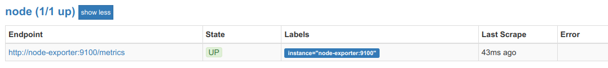
3. Ведется сбор данных
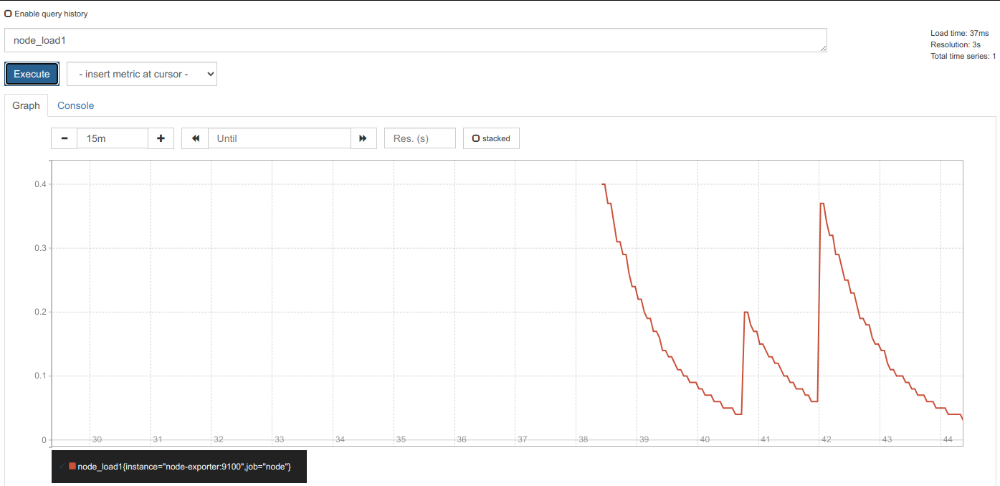
4. Проверка мониторинга
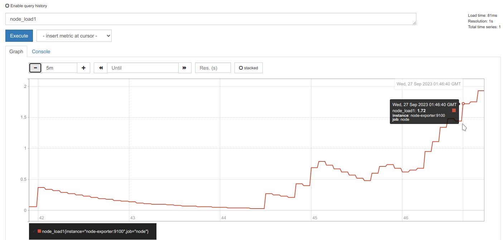
5. Образы загружены на DockerHub и доступны по ссылкам
> https://hub.docker.com/repository/docker/23f03013e37f/ui
> https://hub.docker.com/repository/docker/23f03013e37f/comment
> https://hub.docker.com/repository/docker/23f03013e37f/post
> https://hub.docker.com/repository/docker/23f03013e37f/prometheus

#### Задания со *star*
> Добавить в Prometheus мониторинг MongoDB с использованием необходимого экспортера
1. Для добавления в Prometheus мониторинга ДБ MongoDB был выбран данный актуальный проект
> https://hub.docker.com/r/percona/mongodb_exporter
2. В *docker/docker-compose.yml* файл добавлен сервис:
```yml
  mongodb-exporter:
    image: percona/mongodb_exporter:0.39.0
    command:
      - '--mongodb.uri=mongodb://post_db:27017'
    networks:
      - back_net
```
3. В файл *monitoring/prometheus/prometheus.yml* добавлен endpoint:
```yml
  - job_name: 'mongodb-node-exporter'
    static_configs:
      - targets:
        - 'mongodb-exporter:9216'
```
4. Результат доступных mongodb метрик
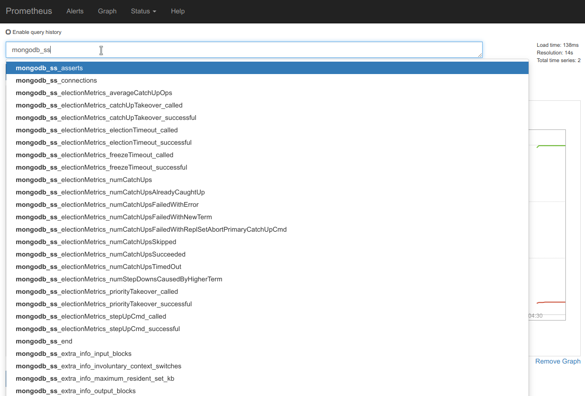
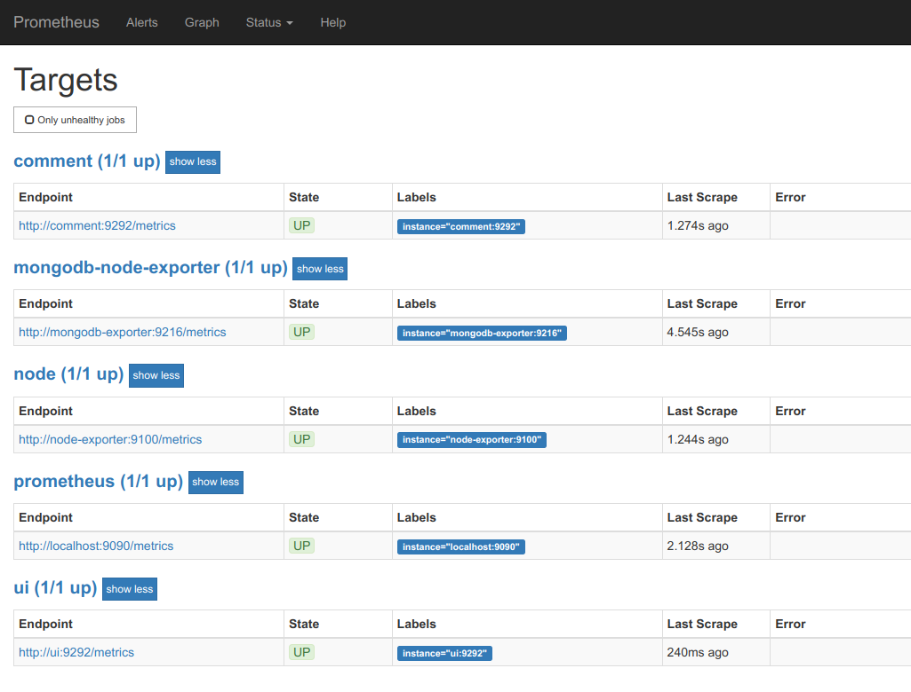

#### Задания со *star*
> Добавить в Prometheus мониторинг сервисов comment, post, ui с помощью blackbox exporter.
1. В директории monitoring/blackbox созданы файлы настроек *blackbox.yml* с модулем http_2xx и Dockerfile
```dockerfile
FROM prom/blackbox-exporter:latest
COPY ./blackbox.yml /etc/blackbox_exporter/config.yml
```
```yml
modules:
  http_2xx:
    prober: http
    timeout: 5s
    http:
      valid_http_versions: ["HTTP/1.1", "HTTP/2.0"]
      valid_status_codes: []
      method: GET
      follow_redirects: false
```
2. В файл *prometheus.yml* добавлен блок работы
```yml
  - job_name: 'blackbox'
    metrics_path: /metrics
    params:
      module: [http_2xx]
    static_configs:
      - targets:
        - http://prometheus.io
        - http://ui:9292/new
        - http://comment:9292
        - http://post:9292
    relabel_configs:
      - source_labels: [__address__]
        target_label: __param_target
      - source_labels: [__param_target]
        target_label: instance
      - target_label: __address__
        replacement: blackbox-exporter:9115
```
1. В файл docker/docker-compose.yml добавлен сервис blackbox-exporter
2. В файл *monitoring/prometheus/prometheus.yml* добавлен target для Cloudprober

3. blackbox запустился в Prometheus


#### Задания со *star*
> Напиcать Makefile
1. В корне репозитария создан файл Makefile
2. Возможные варианты запуска:
- для получения списка команд
```bash
make help
```
- создания образов
```bash
make build-[ui|post|comment|prometheus|blackbox]
```
- push образов в docker.io
```
make push-[ui|post|comment|prometheus|blackbox]
```
- сборка или отправка всех образов
```
make [build|push]-all
```

## <a name="hw20">Устройство Gitlab CI. Построение процесса непрерывной поставки</a>

#### Выполненные работы

1. Подготовлен образ с помощью **packer**'а. Результатом работы является образ с предустановленным *docker* и *docker-compose* и другими пакетами, где на выходе *post-processor "manifest"* создается 'manifest' файл, который содержит image_id.
```json
{
  "builds": [
    {
      "artifact_id": "fd8k6q7qq7sghiuc7h67"
    }
  ]
}
```
2. **terraform** использует данный 'manifest' файл *terraform/stage/packer.auto.tfvars.json*, как *variables*, используя *artifact_id* обзаза.
```tf
resource "null_resource" "image_id" {
  triggers = {
    image_value = split(":", element(var.builds, 0).artifact_id)[0]
  }
}

module "docker" {
...
  docker_image_id  = resource.null_resource.image_id.triggers.image_value
}

variable "builds" {
  type = list(
    object(
      {
        artifact_id     = string
      }
    )
  )
  description = "List of images, as generated by Packer's 'Manifest' post-processor."
}
```
И для раскатки 'gitlab-ci' *docker*'а генерирует из динамического шаблона *inventory.json.tpl* для **ansible** инвентори с внешним IP-адресом, который будет использоваться при установке контейнера 'gitlab-ce:latest', как переменная в шаблоне *docker-compose.yml.j2* и для пункта со \<\*\> в модуле **docker_container**. Так же предусмотрена в **ansible** проверка *gitlab* контейнера и вывод пароля иницализации. Playbook'и организованы с ролями для docker и gitlab.
3. Чтобы решить ошибку недоступности подключения **ansible** к установленной виртуальной машине сразу. использовался дополнительные модуль 'ansible.builtin.wait_for_connection' и проверкой доступности docker контейнера.
4. Установка решения выполняется двумя командами:
```bash
packer build packer/
terraform -chdir=terraform/stage/ apply -auto-approve
```
См. лог gitlab-ci/infra/packer-ansible.md и gitlab-ci/infra/terraform-ansible.md
5. Можно отдельно запускать сам *ansible-playbook*
```bash
ansible-playbook -i ../terraform/stage/inventory.json playbooks/gitlab.yml
```
8. Проверка работы докера можно выполнить по ssh:
```bash
ssh -l ubuntu -i ~/.ssh/id_rsa-appuser 158.160.60.194 docker inspect -f {{.State.Health.Status}} gitlab
```
```output
healthy
```
8. Для получения пароля можно воспользоавться прочтением файла или через **ansible** или *output.tf* из **terraform**
```bash
ssh -l ubuntu -i ~/.ssh/id_rsa-appuser 158.160.60.194 sudo grep -i 'password:' /srv/gitlab/config/initial_root_password
```
9. Если пароль забыт, можно сбросить
>  https://docs.gitlab.com/ee/security/reset_user_password.html#reset-your-root-password
```bash
docker exec -it gitlab bash
gitlab-rake 'gitlab:password:reset[root]'
```
10. После подключения к Gitlab web сайту, выполнено отключение регистрации.
11. Добавлена группа homework, репозиторий example, выполнены пункты задания 4.
12. Зарегистрирован Runner и получен token.
> Проверить, что "Run untagged jobs" установлен.
> Indicates whether this runner can pick jobs without tags
```text
gitlab-runner register --url http://158.160.60.194 --token glrt-CXJApPiVyyGssWMxWVVD
```
1.  Добавлен Runner (и как установка в playbook *gitlab.yml*)
```bash
docker run -d --name gitlab-runner --restart always -v /srv/gitlab-runner/config:/etc/gitlab-runner -v /var/run/docker.sock:/var/run/docker.sock gitlab/gitlab-runner:latest
```
```output
CONTAINER ID   IMAGE                         COMMAND                  CREATED         STATUS                 PORTS                                                            NAMES
ea79446f5691   gitlab/gitlab-runner:latest   "/usr/bin/dumb-init …"   6 minutes ago   Up 6 minutes                                                                            gitlab-runner
2710b85663fa   gitlab/gitlab-ce:latest       "/assets/wrapper"        2 hours ago     Up 2 hours (healthy)   0.0.0.0:80->80/tcp, 0.0.0.0:443->443/tcp, 0.0.0.0:2222->22/tcp   gitlab
```
1.  Регистрация Runner'а
```bash
docker exec -it gitlab-runner gitlab-runner register \
 --url http://158.160.60.194/ \
 --non-interactive \
 --locked=false \
 --name DockerRunner \
 --executor docker \
 --docker-image alpine:latest \
 --registration-token glrt-CXJApPiVyyGssWMxWVVD \
 --tag-list "linux,xenial,ubuntu,docker" \
 --run-untagged
```
```output
Runtime platform arch=amd64 os=linux pid=16 revision=4e724e03 version=16.4.0
Running in system-mode.
...
Verifying runner... is valid runner=CXJApPiVy
Runner registered successfully. Feel free to start it, but if it's running already the config should be automatically reloaded!

Configuration (with the authentication token) was saved in "/etc/gitlab-runner/config.toml"
```
15. Добавлен Reddit в проект, изменен файл .gitlab-ci.yml и добавлен файл simpletest.rb
```bash
git clone https://github.com/express42/reddit.git && rm -rf ./reddit/.git
git add .
git commit -m "Add reddit app"
git push gitlab gitlab-ci-1
```
16. Пройдены тесты в pipeline'е пунктов ДЗ 6.2
17. Добавлены окружения dev, staging, production и выполнены их проверки пунктов ДЗ 7.X
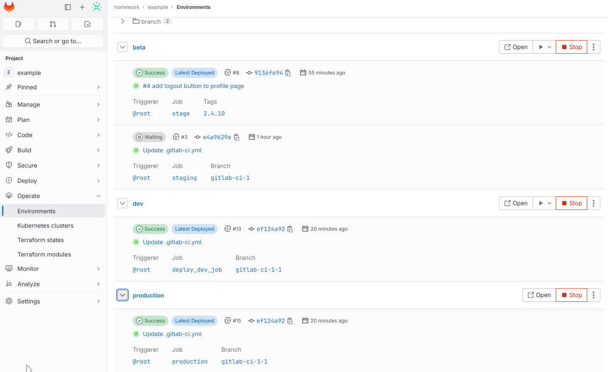
18. Проверены условия, ограничения ручной запуск пунктов ДЗ 8.X
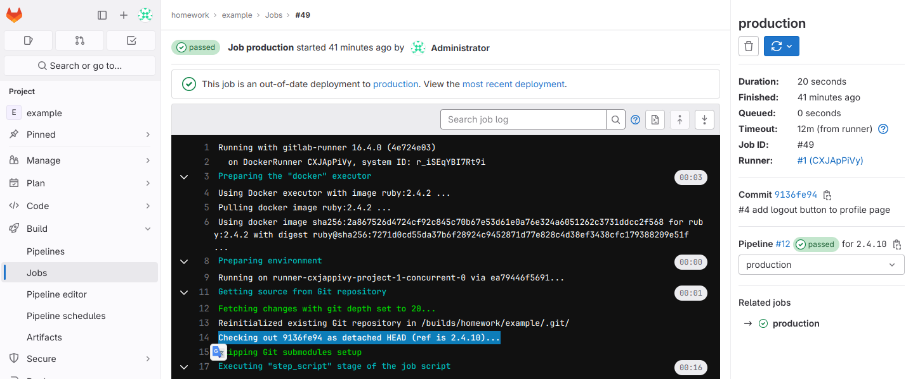
19. Проверено добавление динамических окружений пунктов ДЗ 9.X
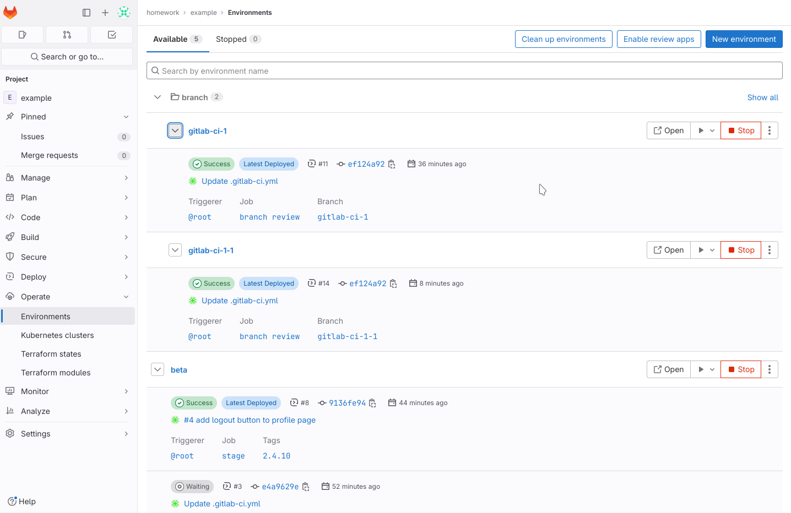

#### Задания со *star*
1. Автоматизацию развёртывания GitLab Runner можно выполнить посредством **ansible** playbook *playbooks/gitlab-runner.yml*
> https://docs.ansible.com/ansible/latest/collections/community/general/gitlab_runner_module.html
```yml

```
Только token необходимо указывать при запуске playbook'а, так как получение возможно(?) только с web-интерфейса.

2. Настройка уведомлений из Gitlab в Slack
В Slack была настроена новый Workspace otus-devops-2023-05 и в настройках получены token'ы

Заполнение полей в Gitlab
> http://gitlab/admin/application_settings/general#js-slack-settings

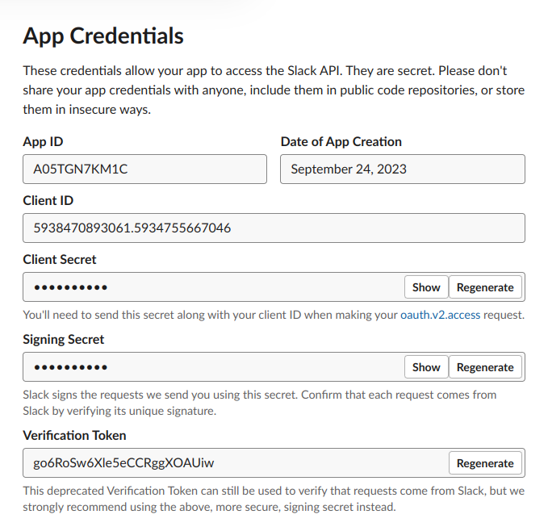


> https://computingforgeeks.com/gitlab-and-slack-integration-for-notifications/
Далее необходимо настроить webhook и добавить его к Gitlab проекту
> https://docs.gitlab.com/ee/ci/chatops/index.html

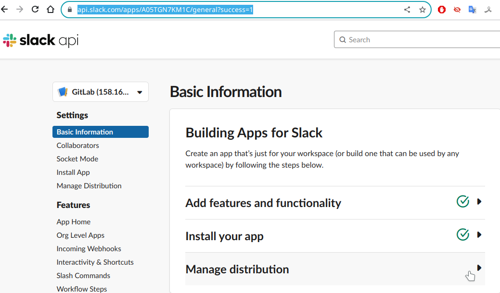

Получение ссылки для webhook'а

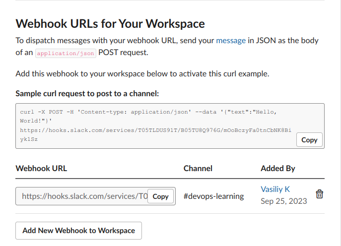

Добавление уведомлений в Gitlab для Slack

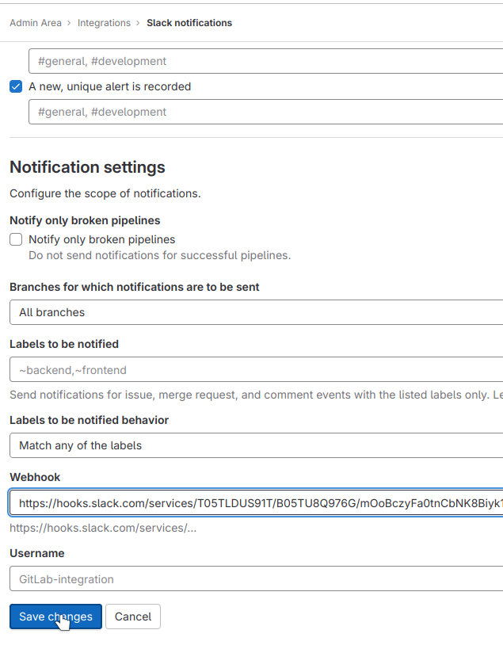

Получение уведомления о merge ветки gitlab-ci-1-1 в main

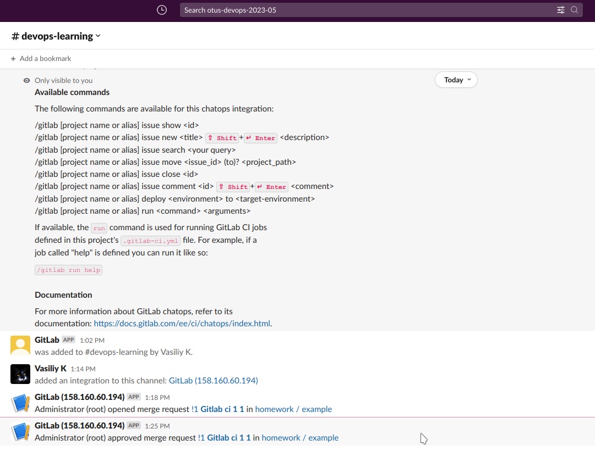
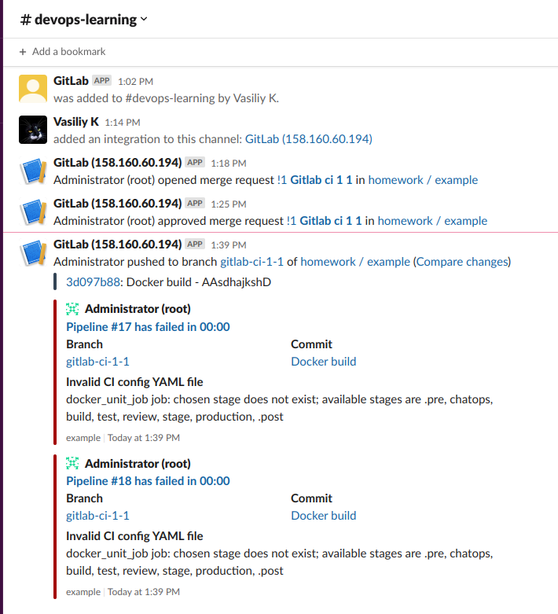

3. Запуск reddit в контейнере
> https://docs.gitlab.com/ee/ci/docker/using_docker_build.html

```bash
docker exec -it gitlab-runner gitlab-runner register -n --url http://158.160.60.194 --name MyDockerRunner --registration-token "glrt-CXJApPiVyyGssWMxWVVD" --executor docker --docker-image "docker:19.03.12" --docker-privileged --docker-volumes "/certs/client"

```
При использовании версии 19.03.12 возникает ошибка 'cgroups: cgroup mountpoint does not exist: unknown'
> https://gitlab.com/gitlab-org/gitlab-runner/-/issues/29132
```yml
build_job:
  stage: build
  image: docker:20.10.17
  variables:
    DOCKER_TLS_CERTDIR: "/certs"
  services:
    - docker:20.10.17-dind
  before_script:
    - docker info
  script:
    - echo 'Building'
    - docker build -t reddit-docker-image .
    - docker run reddit-docker-image
  only:
    - branches
  except:
    - master
    - main
```
Прохождение этапа формирования образа docker-in-docker (dind)
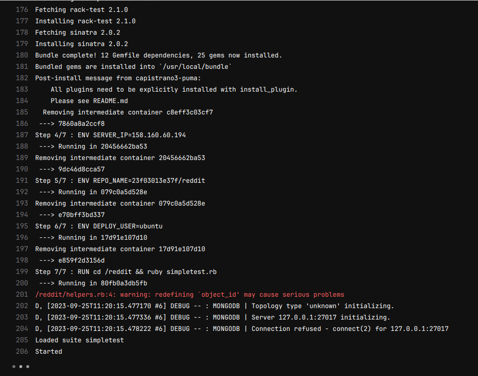
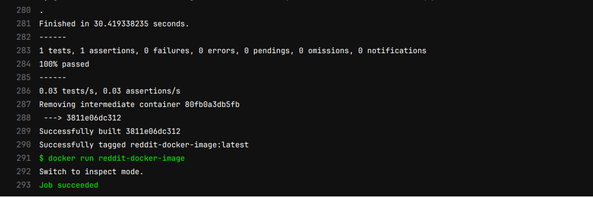

## <a name="hw18">Docker сети, docker-compose</a>

#### Выполненные работы

1. Подключение в облаке docker host'у
```bash
DOCKER_MACHINE="$(yc compute instance create \
 --name docker-host \
 --zone ru-central1-a \
 --core-fraction 5 \
 --cores 2 \
 --network-interface subnet-name=default-ru-central1-a,nat-ip-version=ipv4 \
 --create-boot-disk image-folder-id=standard-images,image-family=ubuntu-1804-lts,size=15 \
 --ssh-key ~/.ssh/id_rsa-appuser.pub \
 | awk '/nat:/ { getline; print $2}')"

docker-machine create \
 --driver generic \
 --generic-ip-address=$DOCKER_MACHINE \
 --generic-ssh-user yc-user \
 --generic-ssh-key ~/.ssh/id_rsa-appuser \
 docker-host

docker-machine ls
eval $(docker-machine env docker-host)
```
2. Проверка различных вариантов настройки сетей:
```bash
for i in none host; do docker run -ti --rm --network $i joffotron/docker-net-tools -c ifconfig; done
```
3. Сравнить с выводом команды ifconfig docker-host'а невозможно, так как нет утилиты, можно доустановить *net-tools*
```bash
$ docker-machine ssh docker-host ifconfig
bash: ifconfig: command not found
exit status 127

$ docker-machine ssh docker-host which ifconfig
exit status 1

$ docker-machine ssh docker-host which ip
/sbin/ip

$ docker-machine ssh docker-host ip add
1: lo: <LOOPBACK,UP,LOWER_UP> mtu 65536 qdisc noqueue state UNKNOWN group default qlen 1000
    link/loopback 00:00:00:00:00:00 brd 00:00:00:00:00:00
    inet 127.0.0.1/8 scope host lo
       valid_lft forever preferred_lft forever
    inet6 ::1/128 scope host
       valid_lft forever preferred_lft forever
2: eth0: <BROADCAST,MULTICAST,UP,LOWER_UP> mtu 1500 qdisc mq state UP group default qlen 1000
    link/ether d0:0d:43:72:59:ac brd ff:ff:ff:ff:ff:ff
    inet 10.128.0.18/24 brd 10.128.0.255 scope global eth0
       valid_lft forever preferred_lft forever
    inet6 fe80::d20d:43ff:fe72:59ac/64 scope link
       valid_lft forever preferred_lft forever
4: docker0: <NO-CARRIER,BROADCAST,MULTICAST,UP> mtu 1500 qdisc noqueue state DOWN group default
    link/ether 02:42:28:3b:9c:07 brd ff:ff:ff:ff:ff:ff
    inet 172.17.0.1/16 brd 172.17.255.255 scope global docker0
       valid_lft forever preferred_lft forever

```
5. После запуска несколько раз команды
```bash
docker run --network host -d nginx
```
*docker ps* выдает 4 новых экземпляра контейнеров с одного образа с разными именами, но если будет условие использование порта, напрмер, -p 8080:80, то последующие запуски будут неудачны, так как порт будет занят
6. Создана ссылка на *docker-host*'е машине
```bash
$ docker-machine ssh docker-host sudo ln -s /var/run/docker/netns /var/run/netns

$ docker-machine ssh docker-host ls -Al /var/run/netns
lrwxrwxrwx 1 root root 21 Sep 15 13:57 /var/run/netns -> /var/run/docker/netns
```
7. Повторили 5-й пункт с указанием сетей: none и host. Список изменений *namespace*'ов . При использовании сети *None* есть сети на каждый экземпляр:
```text
$ docker-machine ssh docker-host sudo ip netns
7c592d309a71
8ccb91432f3e
95595d213eee
c98d7766dd7a
default
```
А при *host* получаем только один экземпляр, так как нет возможности запустить из-за конфликта использованного порта в одном *net-namespace*'е:
```text
$ docker run -it --network host nginx
/docker-entrypoint.sh: Configuration complete; ready for start up
2023/09/15 14:11:47 [emerg] 1#1: bind() to 0.0.0.0:80 failed (98: Address already in use)
nginx: [emerg] bind() to 0.0.0.0:80 failed (98: Address already in use)
...
$ docker ps
CONTAINER ID   IMAGE     COMMAND                  CREATED         STATUS         PORTS     NAMES
a56ecab5ee9c   nginx     "/docker-entrypoint.…"   2 minutes ago   Up 2 minutes             inspiring_burnell
$ docker-machine ssh docker-host sudo ip netns
default
```
8. Создана по-умолчанию bridge-сеть в docker и проверена недоступность сервисов по *DNS*-именам, которые прописанны в ENV-переменных Dockerfile'ов. Проверено, что с указанием при запуске имен *--name=comment*, *--name=post* всё равно не работает, если не прописать два имени к *docker*'у БД. Поэтому подключение к MongoDB нужно указывать с переменной, например для **comment** docker'а *-e COMMENT_DATABASE_HOST=mongo_db* или использовать *--network-alias*, как в предыдущем ДЗ.
9. Созданы дополнительно две сети: *front_net* и *back_net* и проверена работа запуска контейнеров в разных сетях.
```bash
docker network create back_net --subnet=10.0.2.0/24
docker network create front_net --subnet=10.0.1.0/24
```
10. До момента подключения серверов **post** и **comment** к сетям, у серверов появляется дополнительный интерфейс к этим сетям - *eth1*, таким образом сервер "становится" двухногим.
```bash
$ docker exec -it comment ip addr
...

41: eth1@if42: <BROADCAST,MULTICAST,UP,LOWER_UP,M-DOWN> mtu 1500 qdisc noqueue state UP
link/ether 02:42:0a:00:01:04 brd ff:ff:ff:ff:ff:ff
inet 10.0.1.4/24 brd 10.0.1.255 scope global eth1
valid_lft forever preferred_lft forever
```
11. Рассмотрен сетевой стек bridge network driver'а с доустановкой *bridge-utils* и *net-tools*
```bash
yc-user@docker-host:~$ for i in $(ifconfig | grep br- | cut -d":" -f1); do brctl show $i; done
bridge name     bridge id               STP enabled     interfaces
br-6dfa6a0eeb0b         8000.02428bf36707       no
bridge name     bridge id               STP enabled     interfaces
br-ca3da3d4c146         8000.0242c218da7c       no
bridge name     bridge id               STP enabled     interfaces
br-f3669bbb7452         8000.0242b16ce30c       no              veth52e1e2e
                                                                vetha8e49f0
                                                                vethb32d61a
                                                                vethfab4bc2

$ ps ax | grep docker-proxy
10741 ?        Sl     0:00 /usr/bin/docker-proxy -proto tcp -host-ip 0.0.0.0 -host-port 9292 -container-ip 10.0.1.2 -container-port 9292
10747 ?        Sl     0:00 /usr/bin/docker-proxy -proto tcp -host-ip :: -host-port 9292 -container-ip 10.0.1.2 -container-port 9292

$ sudo iptables -nL -t nat
...

Chain POSTROUTING (policy ACCEPT)
target     prot opt source               destination
MASQUERADE  all  --  10.0.1.0/24          0.0.0.0/0
MASQUERADE  all  --  10.0.2.0/24          0.0.0.0/0
MASQUERADE  all  --  172.17.0.0/16        0.0.0.0/0
MASQUERADE  tcp  --  10.0.1.2             10.0.1.2             tcp dpt:9292
```

12. Установлен docker-compose на локальную машину и собрагы образы приложения reddit
13. Приложение reddit с помощью docker-compose запускается
```bash
$ docker ps
CONTAINER ID   COMMAND                  CREATED         STATUS         PORTS                                       NAMES
a942fd193317   "docker-entrypoint.s…"   7 minutes ago   Up 6 minutes   27017/tcp                                   src-post_db-1
a30c3ff2ba3b   "puma"                   7 minutes ago   Up 6 minutes                                               src-comment-1
babc751f2789   "python3 post_app.py"    7 minutes ago   Up 6 minutes                                               src-post-1
b713005ef641   "puma"                   7 minutes ago   Up 6 minutes   0.0.0.0:9292->9292/tcp, :::9292->9292/tcp   src-ui-1
```
14. Файл *.env* внесён в .gitingore, выполнена копия в *.env.exmaple*
15. Изменён docker-compose.yml для случая использования несколько bridge сетей, сетевых псевдонимов
16. Ответ на вопрос, что все создаваемые docker-compose сущности имеют одинаковый префикс и формирование имен контейнеров зависит от нескольких факторов:
- имя сервиса: Имя контейнера обычно базируется на имени сервиса, определенного в файле docker-compose.yml. Например, если сервис с именем web, Docker Compose будет использовать это имя в формировании имени контейнера.
- префикс проекта: Docker Compose автоматически добавляет префикс, основанный на именовании проекта Docker Compose. Если не явно указано имя проекта с помощью флага -p или переменной окружения COMPOSE_PROJECT_NAME, Docker Compose использует имя директории, где находится файл docker-compose.yml, как имя проекта. Префикс проекта добавляется к именам контейнеров, чтобы обеспечить уникальность, если вы используете несколько проектов.
- суффикс номера инстанса (по умолчанию): Если не задано явное имя контейнера с помощью container_name в файле docker-compose.yml, Docker Compose добавит уникальный номер инстанса в конце имени контейнера. Например, если у вас есть сервис с именем web и два контейнера этого сервиса, их имена могут выглядеть как myproject-web-1 и myproject-web-2, где myproject - это имя проекта, web - имя сервиса, а 1 и 2 - номера инстансов.
17. Явное имя контейнера, если указано: Если явно указано имя контейнера с помощью параметра container_name в файле docker-compose.yml, то будет использоваться это имя вместо автоматически сгенерированного.

#### Задания со *star*
1. Создан docker-compose.override.yml
2. Для изменения настроек приложения, возможно выполнить подключечния тома, как и для БД.
```bash
$ docker-machine ssh docker-host sudo ls -Al /var/lib/docker/volumes/src_ui_app/_data
total 48
-rw-r--r-- 1 root root  396 Sep 13 09:01 config.ru
...
```
3. Для запуска puma приложений в режиме диагностики с двумя процессами *--debug* и *-w 2* можно добавить **command**: puma --debug -w 2
```bash
$ docker ps
CONTAINER ID   IMAGE                      COMMAND                  CREATED         STATUS         PORTS                                       NAMES
f441fae2fbcd   23f03013e37f/ui:1.0        "puma --debug -w 2"      9 seconds ago   Up 4 seconds   0.0.0.0:8080->9292/tcp, :::8080->9292/tcp   src-ui-1
...

$ docker logs $(docker ps -a -q --filter "name=src-ui-1") | head -5
[1] Puma starting in cluster mode...
[1] * Version 3.10.0 (ruby 2.3.1-p112), codename: Russell's Teapot
[1] * Min threads: 0, max threads: 16
[1] * Environment: development
[1] * Process workers: 2
```

## <a name="hw17">Микросервисы</a>

#### Выполненные работы

1. Установлен **hadolint**'ер из AUR и проверены *Dockerfile*'ы **ui/post/comment**, здесь по рекомендациям DL3020 внесены изменения
2. Выполнены подготовка и подключение к ранее созданному Docker host’у
3. Организована новая структура приложения из архива *https://github.com/express42/reddit/archive/microservices.zip* в папке *src*
4. Внесены изменения в *Dockerfile*'ы:
- для **ui** добавлена версия к RUN
```dockerfile
gem install bundler -v 2.3.26
```
- для **comment**:
  - изменен источник образа на *ruby:2.2.10-alpine*
  - для исправления ошибки со сборкой Requested MarkupSafe>=2.0 заменён ADD на COPY
```dockerfile
FROM python:3.6.0-alpine
WORKDIR /app
COPY VERSION *.py requirements.txt VERSION ./
RUN apk --no-cache --update add build-base \
    && pip install --upgrade pip \
    && pip install -r /app/requirements.txt
...
```
- для **post** добавлено обновление pip
```
dockerfile pip install --upgrade pip
```
5. К запуску контейнера ДБ установлена версия для совместимости со старыми версиями приложений
```bash
docker run -d \
  --network=reddit --network-alias=post_db --network-alias=comment_db \
  --volume reddit_db:/data/db \
  mongo:4.4.24
```
6. Все контейнеры собраны, сеть и том *reddit_db* для ДБ добавлены для сохранения потсов, прилоежния успешно запущены и проверена работоспособность http://\<docker-host-ip\>:9292/
```bash
DOCKER_MACHINE="$(yc compute instance create \
 --name docker-host \
 --zone ru-central1-a \
 --network-interface subnet-name=default-ru-central1-a,nat-ip-version=ipv4 \
 --create-boot-disk image-folder-id=standard-images,image-family=ubuntu-1804-lts,size=15 \
 --ssh-key ~/.ssh/id_rsa-appuser.pub \
 | awk '/nat:/ { getline; print $2}')"

docker-machine create \
 --driver generic \
 --generic-ip-address=$DOCKER_MACHINE \
 --generic-ssh-user yc-user --generic-ssh-key ~/.ssh/id_rsa-appuser \
 docker-host

docker-machine ls
eval $(docker-machine env docker-host)
```
7. Оптимизация образа образа **ui**
```text
$ docker images
REPOSITORY   TAG             IMAGE ID       CREATED          SIZE
ui           3.0             6eeb034379b9   3 minutes ago    225MB
ui           1.0             b7eb7bded98b   44 minutes ago   482MB
```

#### Задания со *star*

1. Перезапущены контейнеры контейнеры с другими сетевыми алиасами с префиксом "test_", необходмо указать новые ENV в команде
```bash
docker run -d --network=reddit --network-alias=test_post_db --network-alias=test_comment_db -v reddit_db:/data/db mongo:4.4.24
docker run -d --network=reddit --network-alias=test_post -e POST_DATABASE_HOST=test_post_db post:1.0
docker run -d --network=reddit --network-alias=test_comment -e COMMENT_DATABASE_HOST=test_comment_db comment:1.0
docker run -d --network=reddit -p 9292:9292 -e POST_SERVICE_HOST=test_post -e COMMENT_SERVICE_HOST=test_comment ui:1.0
```
2. Создан *Dockerfile.01* для **ui** образ на основе Alpine, как и **comment**
```dockerfile
docker build -t <dockerhub-login>/ui:3.0 ./ui --file ui/Dockerfile.01
```
3. Запуск контейнера **mongo** с volume reddit_db сохраняет данные ДБ в папке */var/lib/docker/volumes/reddit_db/_data* и после перезапуска пост остается доступен на портале

## <a name="hw16">Введение в Docker</a>

#### Выполненные работы

1. Создан репозиторий **docker-2** и устанавлены **docker** и **docker-tools**
2. Создан новый проект **docker**
3. Создан там **docker-host** с помощью *docker-machine*
4. Выполнено подключение к удаленному *docker instance* в **docker-hub**

#### Задания со *star*

1. В *docker-1.log* внесена информация по выполнению реализации в виде прототипа в директории /docker-monolith/infra/:
-  *packer* в связке с *ansible*, файл *docker.json* - шаблон пакера, который создает с ansible playbook образ в облаке.
-  *terraform* со структурой *terraform/stage* и модулей *modules/docker*,
-  *ansible* с учетом ролей и playbooks для *docker* terraform модуля
2. В файле *docker-2-star.log* приводится результат создания инфрастуктуры с помошью terraform'а и ранее созданного *packer*'ом образа, где используется счётчик (их количество задается переменной):
3. Изменен *outputs.tf* так, что можно создавать различные ansible inventory: INI, YAML, JSON
4. Добавлен для автоматизации provisioners для уставноки docker'а reddit в облачные docker'ы в ЯОблаке с учетом сгенерированного в output динамического интентори.
- результат выполнения в
5. В файле *docker-2-additional-star.log* лог автоматизиванного выполения за раз развертывания docker'ов по счётчику, а так же сразу выполнение установки и запуска приложений в контейнерах.
6. Добавлены *null_resource*'ы для запуска ansible playbook'а
