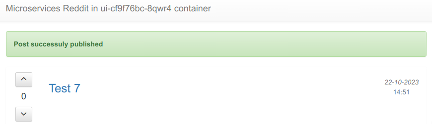
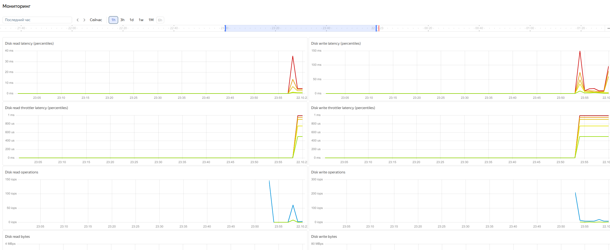
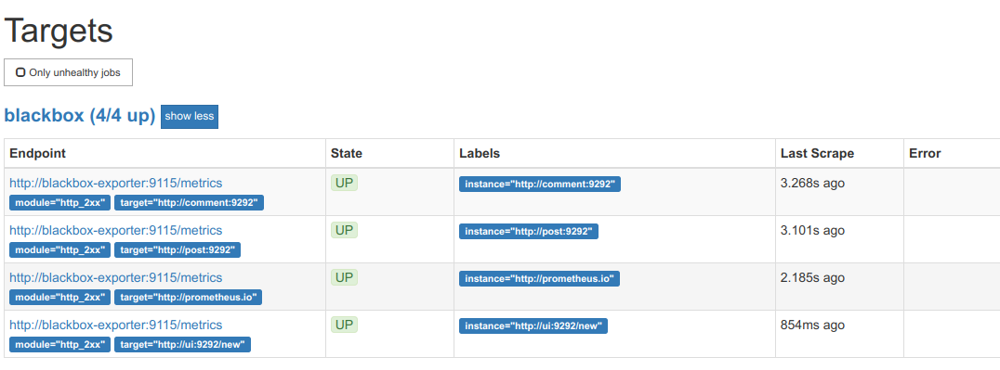

# aasdhajkshd_microservices

aasdhajkshd microservices repository

## Содержание

* [docker-2 Технология контейнеризации. Введение в Docker](#hw16)
* [docker-3 Docker-образы Микросервисы](#hw17)
* [docker-4 Docker сети, docker-compose](#hw18)
* [gitlab-ci-1 Устройство Gitlab CI. Построение процесса непрерывной поставки](#hw20)
* [monitoring-1 Введение в мониторинг. Системы мониторинга](#hw22)
* [kubernetes-1 Введение в kubernetes](#hw27)
* [kubernetes-3 Kubernetes. Networks, Storages](#hw30)

## <a name="hw30">Введение в kubernetes</a>

> <span style="color:red">INFO</span>
<span style="color:blue">Информация на картинках, как IP адреса или время, может отличаться от приводимой в тексте! Суть в это не меняется.</span>

#### Выполненные работы

Список литературы и статей:

- [Минимально жизнеспособный Kubernetes](https://habr.com/ru/companies/otus/articles/513344/)
- [Kubernetes The Hard Way](https://github.com/kelseyhightower/kubernetes-the-hard-way)
- [Kubernetes и другие оркестраторы](https://habr.com/ru/companies/kts/articles/591355/)
- [Yandex Managed Service для Kubernetes](https://cloud.yandex.ru/docs/managed-kubernetes/)
- [Настройка групп безопасности](https://cloud.yandex.ru/docs/managed-kubernetes/operations/connect/security-groups)
- [Сервисные аккаунты](https://cloud.yandex.ru/docs/iam/concepts/users/service-accounts)
- [Обеспечение доступа к приложению, запущенному в кластере Kubernetes](https://cloud.yandex.ru/docs/managed-kubernetes/operations/create-load-balancer)
- [Как начать работать с Network Load Balancer](https://cloud.yandex.ru/docs/network-load-balancer/quickstart)
- [Проверка доступности ресурсов](https://cloud.yandex.ru/docs/network-load-balancer/concepts/health-check)
- [Kubernetes DNS for Services and Pods](https://medium.com/kubernetes-tutorials/kubernetes-dns-for-services-and-pods-664804211501)
- [Сетевые политики кластера Kubernetes](https://cloud.yandex.ru/docs/managed-kubernetes/concepts/network-policy)
- [Использование объектов API Kubernetes](https://cloud.yandex.ru/docs/managed-kubernetes/concepts/volume)
- [Create MongoDB server on Kubernetes with PersistentVolume](https://mazzine.medium.com/create-mongodb-server-on-kubernetes-with-persistentvolume-6cab32dde2fc)
- [Динамическая подготовка тома](https://cloud.yandex.ru/docs/managed-kubernetes/operations/volumes/dynamic-create-pv)
- [Управление классами хранилищ](https://cloud.yandex.ru/docs/managed-kubernetes/operations/volumes/manage-storage-class#sc-default)
- [kubectl Cheat Sheet](https://kubernetes.io/docs/reference/kubectl/cheatsheet/)

Абстракции над подами

- [Deployment](https://kubernetes.io/docs/concepts/workloads/controllers/deployment) — инструмент контроля за состоянием подов
- [ReplicaSet](https://kubernetes.io/docs/concepts/workloads/controllers/replicaset/) — запускает несколько подов
- [DaemonSet](https://kubernetes.io/docs/concepts/workloads/controllers/daemonset/) — запускает строго один под на каждом узле кластера
- [StatefulSet](https://kubernetes.io/docs/concepts/workloads/controllers/statefulset/) — запускает нумерованные поды для stateful-приложений
- [Job](https://kubernetes.io/docs/concepts/workloads/controllers/job/) — запускает под один раз, пока он не завершится успешно
- [CronJob](https://kubernetes.io/docs/concepts/workloads/controllers/cron-jobs/) — запускает Job по крону (расписанию)

Так как на странице **24** домашнего задания представлена картинка управлеяемого кластера, выполнение пунктов выполнялась с установкой Yandex Managed Service для Kubernetes кластере *infra-kube*.

### Создание управляемого кластера для Kubernetes в YC

1. Настройка групп безопасности

```bash
yc vpc security-group create --name yc-security-group --network-name default \
--rule 'direction=ingress,port=443,protocol=tcp,v4-cidrs=0.0.0.0/0' \
--rule 'direction=ingress,port=80,protocol=tcp,v4-cidrs=0.0.0.0/0' \
--rule 'direction=ingress,from-port=0,to-port=65535,protocol=any,predefined=self_security_group' \
--rule 'direction=ingress,from-port=0,to-port=65535,protocol=any,v4-cidrs=[10.96.0.0/16,10.112.0.0/16,10.128.0.0/16]' \
--rule 'direction=ingress,from-port=0,to-port=65535,protocol=tcp,v4-cidrs=[198.18.235.0/24,198.18.248.0/24]' \
--rule 'direction=egress,from-port=0,to-port=65535,protocol=any,v4-cidrs=0.0.0.0/0' \
--rule 'direction=ingress,protocol=icmp,v4-cidrs=[10.0.0.0/8,192.168.0.0/16,172.16.0.0/12]' \
--rule 'direction=ingress,from-port=30000,to-port=32670,protocol=tcp,v4-cidrs=0.0.0.0/0' \
--rule 'direction=ingress,from-port=0,to-port=65535,protocol=tcp,predefined=loadbalancer_healthchecks'

```

2. Запишем в переменную `<id группы безопасности>`:

```bash
export SG_ID=$(yc vpc security-group get --name yc-security-group | head -1 | awk '{print $2}')
echo $SG_ID
```

3. Создадим сервисный аккаунт для кластера Kubernetes:

```bash
YC_SVC_ACCT="kube-infra"
YC_FOLDER_ID=$(yc config get folder-id)
YC_SUBNET_ID=$(yc vpc subnet get default-ru-central1-a | head -1 | awk -F ': ' '{print $2}')
YC_FOLDER_NAME="infra"

yc iam service-account create kube-infra
yc iam service-account create --name=$YC_SVC_ACCT --folder-id=$YC_FOLDER_ID

YC_ACCT_ID=$(yc iam service-account get $YC_SVC_ACCT | grep ^id | awk '{print $2}')

yc resource-manager folder add-access-binding \
  --name=default \
  --id=$YC_FOLDER_ID \
  --folder_id=$YC_FOLDER_ID \
  --service-account-id=$YC_ACCT_ID \
  --role=editor

yc iam key create --service-account-id=$YC_ACCT_ID \
  --output=../../kubernetes/infra/.secrets/$YC_SVC_ACCT.json

```

4. Создаём публичный зональный кластер в зоне ru-central1-a:

```bash
yc managed-kubernetes cluster create \
  --name=kube-infra \
  --public-ip \
  --network-name=default \
  --service-account-name=$YC_SVC_ACCT \
  --node-service-account-name=$YC_SVC_ACCT \
  --release-channel=rapid \
  --zone=ru-central1-a \
  --version=1.27 \
  --security-group-ids=$SG_ID \
  --enable-network-policy \
  --folder-name=$YC_FOLDER_NAME
```

5. Создаём рабочую группу из одного узла:

> С помощью флага --preemptible будут создаваться прерываемые инстансы, которые намного дешевле обычных. [О таких инстансах](https://cloud.yandex.ru/docs/compute/concepts/preemptible-vm)

```bash
yc managed-kubernetes node-group create \
  --name=kube-group \
  --cluster-name=kube-infra \
  --cores=2 \
  --memory=4G \
  --preemptible \
  --auto-scale=initial=1,min=1,max=2 \
  --network-interface=subnets=default-ru-central1-a,ipv4-address=nat,security-group-ids=$SG_ID \
  --folder-name=$YC_FOLDER_NAME \
  --metadata="ssh-keys=yc-user:~/.ssh/id_rsa-appuser.pub"
```

6. Получаем конфигигурацию и выполняем подключение:

```bash
yc managed-kubernetes cluster get-credentials --name=kube-infra --force --external
```

> В результате в файл `~/.kube/config` будут добавлены user, cluster, и context для подключения к кластеру в Yandex Cloud.

> Данную команду нужно выполнять каждый раз после при запуска при динамическом внешнем адресе кластера:

```bash
yc managed-kubernetes cluster start kube-infra

yc application-load-balancer load-balancer list --format json | jq -r '.[].id' | xargs -n1 yc application-load-balancer load-balancer start

yc load-balancer network-load-balancer list --format json| jq -r '.[].id' | xargs -n1 yc load-balancer network-load-balancer start
```

7. Проверяем, что доступ есть и нода создалась:

```bash
kubectl get nodes
```

> Результат:

```output
NAME                        STATUS   ROLES    AGE   VERSION
cl1vhjhn7vldqi2v6ucs-avys   Ready    <none>   37h   v1.27.3
cl1vhjhn7vldqi2v6ucs-ytiw   Ready    <none>   37h   v1.27.3
```

```bash
kubectl cluster-info
```

> Результат:

```output
Kubernetes control plane is running at https://158.160.100.194
CoreDNS is running at https://158.160.100.194/api/v1/namespaces/kube-system/services/kube-dns:dns/proxy

To further debug and diagnose cluster problems, use 'kubectl cluster-info dump'.
```

8. Конфигурация контекста

```bash
kubectl config current-context
```

> Результат:

```output
yc-kube-infra
```

9. Запустим reddit проект в `namespace dev`:

> в манифестах используется из предыдущего домашнего задания *gitlab-ci* ранее подготовленные образы из [docker hub'а](https://hub.docker.com/repositories/23f03013e37f)

```bash
for i in `/usr/bin/ls dev-namespace.yml comment* mongo* post* ui*`; do kubectl apply -n dev -f $i; done
```

Но, так как ранее сервис базы данных и сервис фронтенда были разнесены по разным сетям, mongo ДБ недоступна по именам post-db и comment-db. В лог сервиса post наблюдаем такую ошибку:

```output
{"event": "find_all_posts", "level": "info", "message": "Successfully retrieved all posts from the database", "params": {}, "request_id": "93e56309-2e21-434f-a7e0-542b9c95ae85", "service": "post", "timestamp": "2023-10-20 21:14:24"}
{"event": "internal_error", "level": "error", "method": "GET", "path": "/posts?", "remote_addr": "10.112.129.13", "request_id": "93e56309-2e21-434f-a7e0-542b9c95ae85", "service": "post", "timestamp": "2023-10-20 21:14:54", "traceback": "Traceback (most recent call last):
...
  File "/usr/local/lib/python3.6/site-packages/pymongo/topology.py", line 189, in select_servers
    self._error_message(selector))
pymongo.errors.ServerSelectionTimeoutError: post_db:27017: [Errno -2] Name does not resolve
"}
```

В Kubernetes так добавить дополнительные имена: post-db и comment-db к *Deployment* mongo нет возможности, чтобы запись появилась в coredns Pod'е. Найдено два решения проблемы:

- использовать переменные у comment и post

```yaml
spec:
  env:
  - name: COMMENT_DATABASE_HOST
    value: mongo
```

- использовать сервис ExternalName

```yaml
---
apiVersion: v1
kind: Service
metadata:
  name: post-db
spec:
  type: ExternalName
  externalName: "mongo.dev.svc.cluster.local"

---
apiVersion: v1
kind: Service
metadata:
  name: comment-db
spec:
  type: ExternalName
  externalName: "mongo.dev.svc.cluster.local"
```

До применения, имя *post-db* недоступно

```bash
kubectl exec -ti -n dev ui-cf9f76bc-8qwr4 -- /bin/bash
root@ui-cf9f76bc-8qwr4:/app# ping post-db
ping: unknown host post-db
```

После:


> Результат:

```bash
root@ui-cf9f76bc-8qwr4:/app# ping mongo
PING mongo.dev.svc.cluster.local (10.96.241.0) 56(84) bytes of data.
^C

root@ui-cf9f76bc-8qwr4:/app# ping post-db
PING mongo.dev.svc.cluster.local (10.96.241.0) 56(84) bytes of data.
^C

root@ui-cf9f76bc-8qwr4:/app# ping comment-db
PING mongo.dev.svc.cluster.local (10.96.241.0) 56(84) bytes of data.
^C

```

### DNS в Kubernetes

> In Kubernetes, you can set up a DNS system with two well-supported add-ons: CoreDNS and Kube-DNS. CoreDNS is a newer add-on that became a default DNS server as of Kubernetes v1.12. However, Kube-DNS may still be installed as a default DNS system by certain Kubernetes installer tools.

1. "Отключение" службы coredns

```bash
kubectl scale deployment --replicas 0 -n kube-system kube-dns-autoscaler
kubectl scale deployment --replicas 0 -n kube-system coredns
kubectl get deployment -n kube-system
```

> Результат:

```output
NAME                  READY   UP-TO-DATE   AVAILABLE   AGE
coredns               0/0     0            0           6h13m
kube-dns-autoscaler   0/0     0            0           6h13m
metrics-server        0/1     1            0           6h13m
```

2. Проверка недоступности DNS:

```bash
kubectl exec ui-764fc4f97d-vr2pj -ti -n default -- /bin/bash

root@ui-764fc4f97d-vr2pj:/app# ping post
ping: unknown host post

root@ui-764fc4f97d-vr2pj:/app# telnet post 5000
telnet: could not resolve post/5000: Temporary failure in name resolution
```

2. Проверка с доступностью DNS:

```bash
kubectl exec ui-764fc4f97d-vr2pj -ti -n default -- telnet post 5000
Trying 10.96.239.150...
Connected to post.default.svc.cluster.local.
Escape character is '^]'.

kubectl scale deployment --replicas 1 -n kube-system coredns kube-dns-autoscaler

kubectl exec ui-764fc4f97d-vr2pj -ti -n default -- ping -c 4 ya.ru
PING ya.ru (77.88.55.242) 56(84) bytes of data.
64 bytes from ya.ru (77.88.55.242): icmp_seq=1 ttl=248 time=3.58 ms
```

### Сервисы

[Типы сервисов](https://kubernetes.io/docs/concepts/services-networking/service/#publishing-services-service-types): ClusterIP, NodePort, LoadBalancer, ExternalName.

**selector** — атрибут, который связывает сервис с подами. Связь происходит через совпадения лейблов. То есть в данном примере наш сервис *post* будет связан с подами, имеющими лейблы *reddit: post*.
**ports** — атрибут, позволяющий объявить порты сервиса и связать их с портами подов. Получается, что обратившись на порт 443 сервиса metrics-server, мы попадём на порт с именем https у подов. В нашем кластере этот порт также равен 443.

> Service объединяет несколько подов в пул и даёт единый сетевой доступ к этому пулу. Это решает проблему непостоянства адреса одиночных подов

#### Сетевые абстракции

1. NodePort

Тип NodePort хоть и предоставляет доступ к сервису, но получить доступ к нашему приложению мы можем через проброс портов утилиты kubectl:

```yaml
---
apiVersion: v1
kind: Service
metadata:
  name: ui
  labels:
    app: reddit
    component: ui
spec:
  type: NodePort
  externalTrafficPolicy: Cluster
  ports:
  - port: 80
    nodePort: 30294
    protocol: TCP
    targetPort: 9292
  selector:
    app: reddit
    component: ui
```

> `kubectl` в отличии от docker команды позволяет воспользоваться табуляцией для выбора нужного Deployment'а контейнера

```bash

kubectl port-forward -n dev ui-cf9f76bc-8qwr4 8888:9292
Forwarding from 127.0.0.1:8888 -> 9292
Handling connection for 8888
```


2. LoadBalancer

```yaml
spec:
  type: LoadBalancer
```

> <span style="color:blue">INFO</span>
> При создании сервиса типа LoadBalancer, контроллер Yandex Cloud создает и настраивает сетевой балансировщик нагрузки в вашем каталоге с публичным IP-адресом.
>


```bash
kubectl get services -n dev -o wide
```

> Результат:

```output
NAME         TYPE           CLUSTER-IP      EXTERNAL-IP                   PORT(S)           AGE    SELECTOR
comment      NodePort       10.96.211.236   <none>                        9292:30263/TCP    2d3h   app=reddit,component=comment
comment-db   ExternalName   <none>          mongo.dev.svc.cluster.local   <none>            31h    <none>
mongo        NodePort       10.96.241.0     <none>                        27017:31944/TCP   2d3h   app=reddit,component=mongo
post         ClusterIP      10.96.238.60    <none>                        5000/TCP          2d3h   app=reddit,component=post
post-db      ExternalName   <none>          mongo.dev.svc.cluster.local   <none>            31h    <none>
ui           LoadBalancer   10.96.232.43    51.250.39.254                 80:30294/TCP      11s    app=reddit,component=ui
```

```bash
kubectl get service -n dev --selector component=ui
```

> Результат:
```output
NAME      TYPE           CLUSTER-IP      EXTERNAL-IP     PORT(S)          AGE
comment   NodePort       10.96.211.236   <none>          9292:30263/TCP   2d3h
ui        LoadBalancer   10.96.232.43    51.250.39.254   80:30294/TCP     34s
```


3. Ingress и TLS Termination

Ingress Сontroller — один из важнейших компонентов кластера Kubernetes. Через него проходят практически все внешние запросы к кластеру.
Для стандартного Nginx Ingress Controller входящий трафик обрабатывается Nginx, который развёрнут внутри кластера и распределяет запросы по сервисам типа ClusterIP.

Для выполнения домашнего задания были рассмотрены два Ingress Сontroller:
- [Yandex ALB Ingress Controller](https://cloud.yandex.ru/docs/application-load-balancer/) - ALB-балансировщик
- [Ingress NGINX Controller](https://kubernetes.github.io/ingress-nginx/)

Для настройки Yandex ALB - можно воспользоваться материалом курса [Деплой инфраструктуры по модели gitops](https://practicum.yandex.ru/profile/ycloud-deploy/)
Пример манифеста `ingress.yml` для Pod'а *httpbin*:

```bash
cat << EOF > httpbin-ingress.yml
apiVersion: networking.k8s.io/v1
kind: Ingress
metadata:
  name: httpbin
  annotations:
    ingress.alb.yc.io/subnets: $(yc vpc subnet get default-ru-central1-a | head -1 | awk -F ': ' '{print $2}')
    ingress.alb.yc.io/external-ipv4-address: $(yc vpc address get infra-alb --format json | jq -r .external_ipv4_address.address)
    ingress.alb.yc.io/group-name: infra-alb
    ingress.alb.yc.io/security-groups: $(yc vpc security-group get --name yc-security-group | head -1 | awk '{print $2}')
spec:
  tls:
    - hosts:
        - "httpbin.infranet.dev"
      secretName: yc-certmgr-cert-id-$(yc certificate-manager certificate list --format json | jq -r '.[] | select(.name == "kube-infra") | .id')
  rules:
    - host: httpbin.infranet.dev
      http:
        paths:
          - path: /
            pathType: Prefix
            backend:
              service:
                name: httpbin
                port:
                  number: 80

EOF

kubectl apply -n httpbin --force=true -f manifests/ingress.yaml

curl https://httpbin.infra.net.ru
```

> <span style="color:blue">INFO</span>
> Здесь же сразу для получения сертификата *letsencrypt* заведен домен *infranet.dev*, изучен и настроен **Cloud DNS**, **Certificate Manager**.

Создадим сертификат на доменное имя:

```bash
yc certificate-manager certificate request \
  --name kube-infra \
  --domains "*.infranet.dev" \
  --challenge dns
```

> Результат:

```output
id: fpqglql78os3ujgdao91
folder_id: b1g0da3u1gqk0nansi59
created_at: "2023-10-18T15:51:36.931798407Z"
name: kube-infra
type: MANAGED
domains:
  - '*.infranet.dev'
status: VALIDATING
updated_at: "2023-10-18T15:51:36.931798407Z"
```

В настройках домена указываются nameservers Яндекса, чтобы и доменными записями управлять через Yandex Cloud:
- ns1.yandexcloud.net
- ns2.yandexcloud.net

Для автоматической проверки владения доменом требуется создать специальную CNAME-запись, ведущую на certificate-manager:
```bash
YC_CERT_ID=$(yc certificate-manager certificate list --format json | jq -r '.[] | select(.name == "kube-infra") | .id')
yc dns zone add-records --name yc-courses --record \
"_acme-challenge.infranet.dev. 600 CNAME $YC_CERT_ID.cm.yandexcloud.net."
yc certificate-manager certificate content --name kube-infra
```

Статус сертификата должен перейти в состояние ISSUED:

```bash
yc certificate-manager certificate list --format json | jq -r '.[] | select(.name == "kube-infra") | .status'
```

Создание wildcard A-записи, указывающую на IP балансировщика:

```bash
yc dns zone add-records --name yc-courses \
--record "*.infranet.dev. 600 A $INFRA_ALB_ADDRESS"
```

> Результат:

```output
+--------+-----------------+------+----------------+-----+
| ACTION |      NAME       | TYPE |      DATA      | TTL |
+--------+-----------------+------+----------------+-----+
| +      | *.infranet.dev. | A    | 158.160.81.102 | 600 |
+--------+-----------------+------+----------------+-----+
```


Получить сертификат и ключ из облака

```bash
yc certificate-manager certificate content --name kube-infra
```

Или же загрузить можно свой в кластер:

```bash
kubectl create secret tls ui-ingress --key privkey.pem --cert cert.pem -n dev
kubectl describe secret ui-ingress -n dev
```

> Результат:
>
```output
Name:         ui-ingress-tls
Namespace:    dev
Labels:       <none>
Annotations:  <none>

Type:  kubernetes.io/tls

Data
====
tls.crt:  1762 bytes
tls.key:  1676 bytes
```

Ниже приводится настройка Ingress NGINX Controller'а

```bash
helm upgrade \
--create-namespace \
--namespace ingress-nginx \
--set folderId=$YC_FOLDER_ID \
--set clusterId=$YC_CLUSTER_ID \
--install ingress-nginx ingress-nginx \
--set-file saKeySecretKey=../../kubernetes/infra/.secrets/$YC_SVC_ACCT \
--repo https://kubernetes.github.io/ingress-nginx \
--atomic
```

> Результат:

```outpout
Release "ingress-nginx" does not exist. Installing it now.
NAME: ingress-nginx
LAST DEPLOYED: Fri Oct 20 15:56:45 2023
NAMESPACE: ingress-nginx
STATUS: deployed
REVISION: 1
TEST SUITE: None
NOTES:
The ingress-nginx controller has been installed.
It may take a few minutes for the LoadBalancer IP to be available.
You can watch the status by running 'kubectl --namespace ingress-nginx get services -o wide -w ingress-nginx-controller'
...
```

Как результат приводится пример yaml файла, который был адаптирован для приложения *reddit* - ui-ingress.yml с **добавляем** в Ingress использование TLS-сертификата

```bash
cat << EOF > ui-ingress.yml
---
apiVersion: networking.k8s.io/v1
kind: Ingress
metadata:
  name: ui
  namespace: dev
  annotations:
    kubernetes.io/ingress.class: "nginx"
    nginx.ingress.kubernetes.io/rewrite-target: /
    kubernetes.io/ingress.allow-http: "false"
spec:
  ingressClassName: nginx
  rules:
    - host: reddit.infranet.dev
      http:
        paths:
          - pathType: Prefix
            backend:
              service:
                name: ui
                port:
                  number: 80
            path: /*
  tls:
    - hosts:
      - reddit.infranet.dev
      secretName: ui-ingress-tls
---
apiVersion: v1
kind: Secret
metadata:
  name: ui-ingress-tls
  namespace: dev
data:
  tls.crt: $(cat certs/cert.pem | base64 -w 0)
  tls.key: $(cat certs/key.pem | base64 -w 0)
type: kubernetes.io/tls

EOF

kubectl apply -n dev -f ui-service.yml -f ui-ingress.yml
```

Применяем и ui-service.yml, так как поменялся тип на ClusterIP


```bash
kubectl get ingress -n dev -o wide
```

> Результат:

```output
NAME   CLASS   HOSTS                 ADDRESS          PORTS     AGE
ui     nginx   reddit.infranet.dev   158.160.81.102   80, 443   28h
```


### Задание со *

[Secret](https://kubernetes.io/docs/concepts/services-networking/ingress/#tls)

```yaml
---
apiVersion: v1
kind: Secret
metadata:
  name: ui-ingress-tls
  namespace: dev
data:
  tls.crt: base64 encoded cert
  tls.key: base64 encoded key
type: kubernetes.io/tls
```

### Network Policy

```bash
yc container clusters list
```

> Результат:


В самом начале рассматривались группы безопасности, которые можно применить к самому кластеру `managed-kubernetes cluster` и `managed-kubernetes node-group`.
Пример настройки в web-консоли:


> <span style="color:red">INFO</span>Можно включить использование сетевых политик только при создании кластера.
>
Чтобы включить контроллер сетевых политик Calico, передайте в команде создания кластера Managed Service for Kubernetes параметр --enable-network-policy:

```bash
yc managed-kubernetes cluster create \
...
  --enable-network-policy
```

1. Применён файл *mongo-network-policy.yml*

```bash
kubectl get networkpolicies.networking.k8s.io -n dev
```

> Результат:

```output
NAME              POD-SELECTOR                 AGE
deny-db-traffic   app=reddit,component=mongo   25m
```

2. Для проверки использовался pod *ui*

```bash
kubectl exec -ti -n dev ui-cf9f76bc-8qwr4 -- telnet mongo 27017
```
```output
Trying 10.96.241.0...
^C
```

3. Для обеспечения доступности:

```yaml
    - podSelector:
        matchLabels:
          app: reddit
          component: post
    - podSelector:
        matchLabels:
          app: reddit
          component: ui
    ports:
      - protocol: TCP
        port: 27017
```

> Результат:

```output
Trying 10.96.241.0...
Connected to mongo.dev.svc.cluster.local.
Escape character is '^]'.
^]
```

### Хранилище для базы

1. тип Volume emptyDir

```yaml
  volumeMounts:
    - name: mongo-persistent-storage
      mountPath: /data/db
volumes:
  - name: mongo-ps
    emptyDir: {}
```

Сообщения удаляются при перезагрузке или удалении pod'а с ДБ

2. Динамическая подготовка тома

В большинстве случаев нет необходимости вручную создавать объекты PersistentVolumes и диски Compute Cloud. Вместо этого можно создать объекты PersistentVolumeClaim, и Managed Service for Kubernetes автоматически подготовит необходимый объект PersistentVolume и создаст диск.

> При удалении PVC и ReclaimPolicy Delete `kubectl get storageclass` диски удаляются

```yaml
---
apiVersion: v1
kind: PersistentVolumeClaim
metadata:
  name: mongo-pvc
  labels:
    app: reddit
    component: pvc
spec:
  accessModes:
    - ReadWriteOnce
  resources:
    requests:
      storage: 1Gi
  storageClassName: yc-network-hdd
```

3. Статический том

При использовании статического диска, необходимо к PVC добавить атрибут **volumeName** с названием PV.
PVC

```bash
cat << EOF > mongo-volume.yml
---
apiVersion: v1
kind: PersistentVolume
metadata:
  name: mongo-pv
spec:
  capacity:
    storage: 2Gi
  accessModes:
    - ReadWriteOnce
  csi:
    driver: disk-csi-driver.mks.ycloud.io
    fsType: ext4
    volumeHandle: $(yc compute disk show --name mongo-disk --format json | jq .id | tr -d '"')
  storageClassName: yc-network-hdd

EOF
```

```bash
cat << EOF >> mongo-claim.yml
  volumeName: mongo-pv
EOF
```

```bash
kubectl create -n dev -f mongo-claim.yml
kubectl describe -n dev persistentvolumeclaim mongo-pvc
kubectl describe -n dev persistentvolume mongo-pv
```

> Результат:

```output
Name:          mongo-pvc
Namespace:     dev
StorageClass:  yc-network-hdd
Status:        Bound
Volume:        mongo-pv
Labels:        app=reddit
               component=pvc
Annotations:   pv.kubernetes.io/bind-completed: yes
Finalizers:    [kubernetes.io/pvc-protection]
Capacity:      2Gi
Access Modes:  RWO
VolumeMode:    Filesystem
Used By:       mongo-6568865f78-drqvs
Events:        <none>
```

```bash
kubectl describe -n dev persistentvolume mongo-pv
```

> Результат:

```output
Name:            mongo-pv
Labels:          <none>
Annotations:     pv.kubernetes.io/bound-by-controller: yes
Finalizers:      [kubernetes.io/pv-protection external-attacher/disk-csi-driver-mks-ycloud-io]
StorageClass:    yc-network-hdd
Status:          Bound
Claim:           dev/mongo-pvc
Reclaim Policy:  Retain
Access Modes:    RWO
VolumeMode:      Filesystem
Capacity:        2Gi
Node Affinity:   <none>
Message:
Source:
    Type:              CSI (a Container Storage Interface (CSI) volume source)
    Driver:            disk-csi-driver.mks.ycloud.io
    FSType:            ext4
    VolumeHandle:      fhmq2jmvqv725chbkker
    ReadOnly:          false
    VolumeAttributes:  <none>
Events:                <none>
```

Важно, чтобы Status перешел из *Pending* в **Bound**

4. Тестирование

Удаляем диск и создаем новый, после создаем новый, прописываем в PV id диска *volumeHandle*

```bash
yc compute disk delete --name mongo-disk; \
yc compute disk create --name mongo-disk --size 2 --description "Disk for K8s"; \
cat << EOF > mongo-volume.yml
---
apiVersion: v1
kind: PersistentVolume
metadata:
  name: mongo-pv
spec:
  capacity:
    storage: 2Gi
  accessModes:
    - ReadWriteOnce
  csi:
    driver: disk-csi-driver.mks.ycloud.io
    fsType: ext4
    volumeHandle: $(yc compute disk show --name mongo-disk --format json | jq .id | tr -d '"')
  storageClassName: yc-network-hdd

EOF
kubectl apply -n dev -f mongo-volume.yml -f mongo-claim.yml -f mongo-deployment.yml

kubectl describe -n dev pod mongo
```

> Результат:


После удаления и создания mongo Deployment все сообщения сохранены:



```bash
kubectl delete -n dev -f mongo-deployment.yml

kubectl apply -n dev -f mongo-deployment.yml
```


> Реузльтат:


На картинках ниже будет видно статус использования диска



### kubectl cheatsheet

Полезные команды kubectl, которые могут пригодиться при работы с кластером:

- `kubectl apply -f` — применить манифесты
- `kubectl get <kind>` — получить список объектов <kind>
- `kubectl get <kind> <name> -o wide` — выдает больше информации, в зависимости от kind
- `kubectl get <kind> <name> -o yaml` — в виде yaml
- `kubectl describe <kind> <name>` — текстовое описание + события
- `kubectl edit` — редактирование прямо в терминале любого ресурса
- `kubectl logs <pod_name>` — посмотреть логи пода
- `kubectl port-forward` — пробросить порт из Kubernetes на локальный хост
- `kubectl exec` — выполнить команду внутри запущенного контейнера


## <a name="hw27">Введение в kubernetes</a>

#### Выполненные работы

1. Выполнены изучение и разбор на практике всех компонентов Kubernetes

Список литературы и статей:

- https://kubernetes.io/docs/setup/production-environment/tools/kubeadm/install-kubeadm/
- https://kubernetes.io/docs/setup/production-environment/tools/kubeadm/create-cluster-kubeadm/
- https://kubernetes.io/docs/tasks/administer-cluster/kubeadm/configure-cgroup-driver/
- https://kubernetes.io/docs/reference/kubectl/cheatsheet/
- https://kubernetes.io/docs/reference/command-line-tools-reference/kubelet
- https://h963z57.com/?option=view&id_article=63
- https://github.com/geerlingguy/ansible-role-kubernetes/tree/master
- https://github.com/kubernetes-sigs/kubespray/blob/master/docs/ansible.md
- https://habr.com/ru/articles/508762
- https://habr.com/ru/companies/domclick/articles/682364
- https://www.linuxtechi.com/install-kubernetes-on-ubuntu-22-04
- https://www.linuxsysadmins.com/install-kubernetes-cluster-with-ansible

2. Установка k8s на двух узлах при помощи утилиты kubeadm

> Если docker устанавливается для версии ОС Ununtu 16.04, то будет несовместимость с актуальной версией kubernetes 1.28.

```output
[init] Using Kubernetes version: v1.28.2
[preflight] Running pre-flight checks
error execution phase preflight: [preflight] Some fatal errors occurred:
[ERROR CRI]: container runtime is not running: output: time="2023-10-03T11:35:19Z" level=fatal msg="validate service connection: CRI v1 runtime API is not implemented for endpoint \"unix:///var/run/containerd/containerd.sock\": rpc error: code = Unimplemented desc = unknown service runtime.v1.RuntimeService"
, error: exit status 1
[preflight] If you know what you are doing, you can make a check non-fatal with --ignore-preflight-errors=...
To see the stack trace of this error execute with --v=5 or higher
```

> Если взять версию kube* бинарных файлов версий 1.19.04 и запустить на 16.04, возникает другая ошибка при инициализации с *containerd* сервисом, если добавить SystemdCgroups. Старая версия *containerd* docker'а для xenial не поддерживает этот параметр.
>
> Несмотря на то, что в репозитории google *https://packages.cloud.google.com/apt/dists/kubernetes-xenial* доступны пакеты для Ubuntu 16.04, установка выполняется успешно и на Focal 20.04 и работает с версией 1.6.24 пакета *containerd*
>
> Версии kubernetes 1.28 не зависят от *dockershirm*'а и поэтому можно только устанавливать *containerd.io*. Но для удобства использовался docker-machine, то отдельно роль docker'а не менялась, перенесена из gitlab'а, но является основной для проверки и установки зависимых компонентов для ВМ. А роль kubernetes требует роль docker (для проверки зависимостей).
>
> https://kubernetes.io/docs/setup/production-environment/container-runtimes/
>
> The Dockershim is the CRI compliant layer between the Kubelet and the Docker daemon. As part of the Kubernetes 1.20 release, the deprecation of the in-tree Dockershim was announced. For more information on the deprecation and its timelines, see the Kubernetes Dockershim Deprecation FAQ.
>
> Note: Dockershim has been removed from the Kubernetes project as of release 1.24. Read the Dockershim Removal FAQ for further details.
>
> Вариант с установкой ВМ для master и worker узлов аналогичная

```bash
YC_HOSTNAME="k8s-master"

yc compute instance create \
 --name ${YC_HOSTNAME} \
 --zone ru-central1-a \
 --core-fraction 100 \
 --cores 4 \
 --memory 4GB \
 --network-interface subnet-name=default-ru-central1-a,nat-ip-version=ipv4 \
 --create-boot-disk image-folder-id=standard-images,image-family=ubuntu-2004-lts,size=40,type=network-ssd \
 --ssh-key ~/.ssh/id_rsa-appuser.pub \
 | awk '/nat:/ { getline; print $2}'

YC_HOST_IP=$(yc compute instance list --format json | jq ".[] | select (.name == \"${YC_HOSTNAME}\") | .network_interfaces[0].primary_v4_address.one_to_one_nat.address" | tr -d '"')

docker-machine rm -f ${YC_HOSTNAME}

docker-machine create \
 --driver generic \
 --generic-ip-address=$YC_HOST_IP \
 --generic-ssh-user yc-user \
 --generic-ssh-key ~/.ssh/id_rsa-appuser \
 ${YC_HOSTNAME}

docker-machine ls
eval $(docker-machine env ${YC_HOSTNAME})
docker-machine ssh ${YC_HOSTNAME}
```

```bash
containerd -version
tee "/etc/docker/daemon.json"<<EOF
{
  "exec-opts": ["native.cgroupdriver=systemd"]
}
EOF

apt-get update
apt-get install -y apt-transport-https ca-certificates curl bridge-utils wget vim net-tools

modprobe overlay
modprobe br_netfilter

tee /etc/modules-load.d/modules.conf << EOF
overlay
br_netfilter
EOF

tee /etc/sysctl.d/99-kubernetes.conf <<EOF
net.bridge.bridge-nf-call-ip6tables = 1
net.bridge.bridge-nf-call-iptables = 1
net.ipv4.ip_forward = 1
EOF

sysctl --system
```

> Если установка выполнялась через docker-machine, то добавление docker репозитория нет необходимости
```bash
install -m 0755 -d /etc/apt/keyrings
curl -fsSL https://download.docker.com/linux/ubuntu/gpg | sudo gpg --dearmor -o /etc/apt/keyrings/docker.gpg
chmod a+r /etc/apt/keyrings/docker.gpg

echo "deb [arch="$(dpkg --print-architecture)" signed-by=/etc/apt/keyrings/docker.gpg] https://download.docker.com/linux/ubuntu "$(. /etc/os-release && echo "$VERSION_CODENAME")" stable" | sudo tee /etc/apt/sources.list.d/docker.list > /dev/null

apt-get update
apt-get install -y containerd.io
mkdir -p /etc/containerd
```

> Здесь необходимо продолжить
```bash

containerd config default | sudo tee /etc/containerd/config.toml

sed -i -r -e 's/(SystemdCgroup = )false/\1true/g' /etc/containerd/config.toml

systemctl restart containerd
systemctl enable containerd

curl https://packages.cloud.google.com/apt/doc/apt-key.gpg | sudo gpg --dearmor -o /usr/share/keyrings/cloud.google.gpg
echo "deb [signed-by=/usr/share/keyrings/cloud.google.gpg] https://apt.kubernetes.io/ kubernetes-xenial main" | sudo tee /etc/apt/sources.list.d/kubernetes.list

sudo apt-get update -y
sudo apt-get -y install kubelet=1.28.* kubeadm=1.28.* kubectl=1.28.*
sudo apt-mark hold kubelet kubeadm kubectl
sudo kubeadm config images pull --kubernetes-version v1.28.0

```

Если ранее была какая-то конфигурация, то можно сбросить настройки командой *kubeadm*
```bash
kubeadm reset -f
```

3. Настройка kubernetes на master узле

```bash
curl 'https://api.ipify.org'
kubeadm init --apiserver-cert-extra-sans=158.160.126.171 --apiserver-advertise-address=0.0.0.0 --control-plane-endpoint=158.160.126.171 --pod-network-cidr=10.244.0.0/16
```

На актуальной версии kubernetes --apiserver-advertise-address вызвал ошибку

```output
unknown flag: --apiserver-advertiseaddress
To see the stack trace of this error execute with --v=5 or higher

```
> Подсмотрено здесь https://github.com/torgeirl/kubernetes-playbooks/blob/master/playbooks/master.yml и здесь https://kubernetes.io/docs/reference/config-api/kubeadm-config.v1beta3/

```bash
cat > /etc/kubernetes/kubeadm-config.yaml << EOF
kind: ClusterConfiguration
apiVersion: kubeadm.k8s.io/v1beta3
networking:
  podSubnet: "10.244.0.0/16"
controlPlaneEndpoint: "158.160.126.171"
apiServer:
  certSANs:
    - "158.160.126.171"
---
kind: KubeletConfiguration
apiVersion: kubelet.config.k8s.io/v1beta1
runtimeRequestTimeout: "15m"
cgroupDriver: "systemd"
systemReserved:
  cpu: 100m
  memory: 350M
kubeReserved:
  cpu: 100m
  memory: 50M
enforceNodeAllocatable:
- pods

EOF

kubeadm init --config /etc/kubernetes/kubeadm-config.yaml
```

4. Вывод команды выше: *kubeadm init...*

```output
[init] Using Kubernetes version: v1.28.2
[preflight] Running pre-flight checks
[preflight] Pulling images required for setting up a Kubernetes cluster
[preflight] This might take a minute or two, depending on the speed of your internet connection
[preflight] You can also perform this action in beforehand using 'kubeadm config images pull'
W1004 16:07:13.187465   11637 checks.go:835] detected that the sandbox image "registry.k8s.io/pause:3.6" of the container runtime is inconsistent with that used by kubeadm. It is recommended that using "registry.k8s.io/pause:3.9" as the CRI sandbox image.
...

Your Kubernetes control-plane has initialized successfully!

To start using your cluster, you need to run the following as a regular user:

mkdir -p $HOME/.kube
sudo cp -i /etc/kubernetes/admin.conf $HOME/.kube/config
sudo chown $(id -u):$(id -g) $HOME/.kube/config

Alternatively, if you are the root user, you can run:

export KUBECONFIG=/etc/kubernetes/admin.conf

You should now deploy a pod network to the cluster.
Run "kubectl apply -f [podnetwork].yaml" with one of the options listed at:
https://kubernetes.io/docs/concepts/cluster-administration/addons/

You can now join any number of control-plane nodes by copying certificate authorities
and service account keys on each node and then running the following as root:

kubeadm join 158.160.126.171:6443 --token 1762id.yjr59ik6xf3oquog \
--discovery-token-ca-cert-hash sha256:3342eb8b2ae26622f8d2971d0686bcfe867ed6e82b24f5a9b21d9121c1c22ef2 \
--control-plane

Then you can join any number of worker nodes by running the following on each as root:

kubeadm join 158.160.126.171:6443 --token 1762id.yjr59ik6xf3oquog \
--discovery-token-ca-cert-hash sha256:3342eb8b2ae26622f8d2971d0686bcfe867ed6e82b24f5a9b21d9121c1c22ef2
```

5. Копируется файл с ключами, чтобы от пользователя можно было выполнять команды

```bash
mkdir -p /home/yc-user/.kube
cp /etc/kubernetes/admin.conf /home/yc-user/.kube/config
chown yc-user:yc-user /home/yc-user/.kube/config
```

6. Далее настройки выполняются от пользователя *yc-user*

```bash
su - yc-user
source <(kubectl completion bash)
echo "source <(kubectl completion bash)" >> ~/.bashrc

kubectl get nodes
```

7. Необходимо повторить пункт **2** и для worker узла в другой консоли

```bash
YC_HOSTNAME="k8s-worker"
...
```

8. По-умолчанию сети нет, поэтому необходимо установить pod flannel или calico

```output
NAME         STATUS     ROLES           AGE   VERSION
k8s-master   NotReady   control-plane   12m   v1.28.2
```

- Добавление манифеста pod сети flannel или ниже calico

```bash
kubectl apply -f https://raw.githubusercontent.com/flannel-io/flannel/master/Documentation/kube-flannel.yml
```

9. После установки на worker узел всех программ, выполнить необходимо добавление узла.

```bash
kubeadm join 158.160.126.171:6443 --token 1762id.yjr59ik6xf3oquog \
--discovery-token-ca-cert-hash sha256:3342eb8b2ae26622f8d2971d0686bcfe867ed6e82b24f5a9b21d9121c1c22ef2
```

> Если ключ истек (24 часа), нужно воспользоваться командой

```bash
kubeadm token create --print-join-command
```

Вывод команды добавления:

```output
[preflight] Running pre-flight checks
[preflight] Reading configuration from the cluster...
[preflight] FYI: You can look at this config file with 'kubectl -n kube-system get cm kubeadm-config -o yaml'
[kubelet-start] Writing kubelet configuration to file "/var/lib/kubelet/config.yaml"
[kubelet-start] Writing kubelet environment file with flags to file "/var/lib/kubelet/kubeadm-flags.env"
[kubelet-start] Starting the kubelet
[kubelet-start] Waiting for the kubelet to perform the TLS Bootstrap...

This node has joined the cluster:
* Certificate signing request was sent to apiserver and a response was received.
* The Kubelet was informed of the new secure connection details.

Run 'kubectl get nodes' on the control-plane to see this node join the cluster.
```

10. Добавление плагина сети calico

> https://docs.tigera.io/calico/latest/getting-started/kubernetes/self-managed-onprem/onpremises

```bash
export CALICO_IPV4POOL_CIDR=10.244.0.0/16
kubectl apply -f https://projectcalico.docs.tigera.io/manifests/calico.yaml
```

> по заданию нужно изменить параметр в ранее скачанном файле *calico.yaml*

```bash
wget https://projectcalico.docs.tigera.io/manifests/calico.yaml
sed -i -r -e 's/^([ ]+)# (- name: CALICO_IPV4POOL_CIDR)$\n/\1\2\n\1  value: "10.244.0.0\/16"/g' calico.yaml
kubectl apply -f calico.yaml
```

Вывод команды: *kubectl apply -f calico.yaml*

```output
poddisruptionbudget.policy/calico-kube-controllers created
serviceaccount/calico-kube-controllers created
serviceaccount/calico-node created
serviceaccount/calico-cni-plugin created
configmap/calico-config created
customresourcedefinition.apiextensions.k8s.io/bgpconfigurations.crd.projectcalico.org created
...
daemonset.apps/calico-node created
deployment.apps/calico-kube-controllers created
```

Вывод команды: *kubectl get nodes*

```output
NAME         STATUS   ROLES           AGE    VERSION
k8s-master   Ready    control-plane   69m    v1.28.2
k8s-worker   Ready    <none>          2m6s   v1.28.2
```

Вывод команды: *kubectl get pods -A -o custom-columns=NAME:.metadata.name,IP:.status.podIP,NAME:.spec.nodeName*

```output
NAME                                       IP            NAME
kube-flannel-ds-k8g9s                      10.128.0.21   k8s-worker
kube-flannel-ds-vk856                      10.128.0.24   k8s-master
calico-kube-controllers-7ddc4f45bc-lrdcn   10.244.0.4    k8s-master
calico-node-j84f7                          10.128.0.21   k8s-worker
calico-node-m8nsg                          10.128.0.24   k8s-master
coredns-5dd5756b68-29zxq                   10.244.0.2    k8s-master
coredns-5dd5756b68-cl7ct                   10.244.0.3    k8s-master
etcd-k8s-master                            10.128.0.24   k8s-master
kube-apiserver-k8s-master                  10.128.0.24   k8s-master
kube-controller-manager-k8s-master         10.128.0.24   k8s-master
kube-proxy-l8m4v                           10.128.0.24   k8s-master
kube-proxy-xhqs7                           10.128.0.21   k8s-worker
kube-scheduler-k8s-master                  10.128.0.24   k8s-master
```

11. Созданные ранее манифесты применяются *kubectl get pods*

```output
NAME                               READY   STATUS    RESTARTS   AGE
post-deployment-68db465f9c-lmcv7   1/1     Running   0          2m11s
...
```

#### Задания со *star* *star*

1. Выполнены различные варианты автоматической установки кластера k8s с помощью terraform и ansible.

Packer и ansible: в директории *infra/packer* располагается конфигуарция в hcl формате для подготовки "золотого" образа, а для установки ПО используется playbook *infra/ansible/playbooks/k8s_install.yml*. Данный playbook использует ранее уже созданный из предыдущего ДЗ установку docker'а и вторым шагом установку после kubernetes. Packer создает в последствии manifest файл *infra/terraform/stage/packer.auto.tfvars.json*, в котором есть id артификта образа. В terraform при создании ВМ можно его использовать, сделав замену в *infra/terraform/modules/kubernetes/main.tf*:
~~image_id = data.yandex_compute_image.img.id~~

> Замечено, что если выполнять в облаке разворачивание ВМ с подготовленным диском, то необходмо в terraform внести изменения timeouts, так время занимает для network-ssd - 8 минут, для network-hdd - 15 минут, что превышает время по-умолчанию 5 минут. При использовании общедоступных образов - время составляет не более минуты, но на установку ПО ansible уходит то же время в итоге...

```tf
  timeouts {
    create = "30m"
    delete = "2h"
  }
```

```yaml
  boot_disk {
    initialize_params {
      image_id = var.image_id
...
    }
  }
```

Запустить packer можно из директории *kuternetes/infra:*


```bash
packer build packer/
```

Вывод выполнения создания образа можно найти в **kubernetes/README.md**
> --> yandex.kubernetes: A disk image was created: k8s-base-20231004140023 (id: fd8vps8tcsm1qcec71f5) with family name k8s-base
>

```output
+----------------------+-------------------------+----------+----------------------+--------+
|          ID          |          NAME           |  FAMILY  |     PRODUCT IDS      | STATUS |
+----------------------+-------------------------+----------+----------------------+--------+
| fd85atnjqrc498e0kgd3 | k8s-base-20231001095239 | k8s-base | f2em05j9ahdca5i8iltd | READY  |
| fd8vps8tcsm1qcec71f5 | k8s-base-20231004140023 | k8s-base | f2e004c9e0g7t8b704b7 | READY  |
+----------------------+-------------------------+----------+----------------------+--------+
```

2. Terraform и ansible: В директории kubernetes создайте директории *infra/terraform* и *infra/ansible*  располагаются все необходимые файлы для успешного разворачивания и настройки под ключ с нужным количеством ВМ master и worker-узлов. Их количество определяется переменной "instance_count" в *infra/terraform/modules/kubernetes/variables.tf*.

Запустить deployment можно из директории *kuternetes/infra:*
```bash
terraform -chdir=terraform/stage apply -auto-approve
```

Вывод выполнения установки кластера K8s можно найти в **kubernetes/README.md**
>
```output

null_resource.run_ansible (local-exec): PLAY RECAP *********************************************************************
null_resource.run_ansible (local-exec): k8s-master-0               : ok=60   changed=38   unreachable=0    failed=0    skipped=2    rescued=0    ignored=0
null_resource.run_ansible (local-exec): k8s-worker-0               : ok=43   changed=27   unreachable=0    failed=0    skipped=3    rescued=0    ignored=0

null_resource.run_ansible: Creation complete after 8m10s [id=5347774438499733030]

Apply complete! Resources: 5 added, 0 changed, 0 destroyed.

Outputs:

kubernetes_image_id = "fd8ecgtorub9r4609man"
kubernetes_master_instance = [
[
"fhm8etrc5c5b4rjtvb2i",
],
[
"k8s-master-0",
],
]
kubernetes_master_ip_address = "158.160.126.55"
kubernetes_worker_instance = [
[
"fhmfmokv63v2pfcvlj1r",
],
[
"k8s-worker-0",
],
]
kubernetes_worker_ip_address = "158.160.99.62"
```

Статус кластера
```output
```bash
Welcome to Ubuntu 20.04.6 LTS (GNU/Linux 5.4.0-163-generic x86_64)

* Documentation:  https://help.ubuntu.com
* Management:     https://landscape.canonical.com
* Support:        https://ubuntu.com/advantage
New release '22.04.3 LTS' available.
Run 'do-release-upgrade' to upgrade to it.

Last login: Wed Oct  4 13:50:45 2023 from 79.139.148.255
ubuntu@fhm8etrc5c5b4rjtvb2i:~$ kubectl get nodes
NAME                   STATUS   ROLES           AGE     VERSION
fhm8etrc5c5b4rjtvb2i   Ready    control-plane   4m24s   v1.28.2
fhmfmokv63v2pfcvlj1r   Ready    <none>          3m53s   v1.28.2
```

```bash
ubuntu@fhm8etrc5c5b4rjtvb2i:~$ kubectl get pods -A -o wide
NAMESPACE      NAME                                           READY   STATUS    RESTARTS   AGE     IP              NODE                   NOMINATED NODE   READINESS GATES
kube-flannel   kube-flannel-ds-bwngw                          1/1     Running   0          4m39s   10.128.0.4      fhm8etrc5c5b4rjtvb2i   <none>           <none>
kube-flannel   kube-flannel-ds-mj9ng                          1/1     Running   0          4m24s   10.128.0.9      fhmfmokv63v2pfcvlj1r   <none>           <none>
kube-system    calico-kube-controllers-7ddc4f45bc-f7dwd       1/1     Running   0          4m39s   10.244.107.65   fhm8etrc5c5b4rjtvb2i   <none>           <none>
kube-system    calico-node-fhpqj                              1/1     Running   0          4m39s   10.128.0.4      fhm8etrc5c5b4rjtvb2i   <none>           <none>
kube-system    calico-node-wbshm                              1/1     Running   0          4m24s   10.128.0.9      fhmfmokv63v2pfcvlj1r   <none>           <none>
kube-system    coredns-5dd5756b68-hhr4q                       1/1     Running   0          4m39s   10.244.107.67   fhm8etrc5c5b4rjtvb2i   <none>           <none>
kube-system    coredns-5dd5756b68-ltnc4                       1/1     Running   0          4m39s   10.244.107.66   fhm8etrc5c5b4rjtvb2i   <none>           <none>
kube-system    etcd-fhm8etrc5c5b4rjtvb2i                      1/1     Running   0          4m52s   10.128.0.4      fhm8etrc5c5b4rjtvb2i   <none>           <none>
kube-system    kube-apiserver-fhm8etrc5c5b4rjtvb2i            1/1     Running   0          4m54s   10.128.0.4      fhm8etrc5c5b4rjtvb2i   <none>           <none>
kube-system    kube-controller-manager-fhm8etrc5c5b4rjtvb2i   1/1     Running   0          4m52s   10.128.0.4      fhm8etrc5c5b4rjtvb2i   <none>           <none>
kube-system    kube-proxy-gjqwx                               1/1     Running   0          4m39s   10.128.0.4      fhm8etrc5c5b4rjtvb2i   <none>           <none>
kube-system    kube-proxy-jk6w9                               1/1     Running   0          4m23s   10.128.0.9      fhmfmokv63v2pfcvlj1r   <none>           <none>
kube-system    kube-scheduler-fhm8etrc5c5b4rjtvb2i            1/1     Running   0          4m52s   10.128.0.4      fhm8etrc5c5b4rjtvb2i   <none>           <none>
```

Terraform на основании шаблона *infra/terraform/templates/inventory.json.tpl* создает инвентарный файл для ansible с указанием групп: masters и workers.
Зарускаемый файл terraform'ом playbook - *k8s_deploy.yml*

3. Если уже есть готовые ВМ, можно запускать раздельно установку *k8s_install.yml*, настройку *k8s_configure.yml и проверку *k8s_check.yml*

Из директории *infra/ansible:*
```bash
ansible-playbook playbooks/k8s_deploy.yml
```

В *playbooks/k8s_configure.yml* используется передача token'а для добавления worker-узлов

```yml
- name: Install K8s master base image
  hosts: masters

    ...

      register: join_command_raw

    - debug:
        msg:
          - "{{ join_command_raw.stdout }}"

    - name: Set join command
      set_fact:
        join_command: "{{ join_command_raw.stdout_lines[0] }}"
      delegate_to: "{{ item }}"
      delegate_facts: true
      with_items: "{{ groups['workers'] }}"

- name: Configure K8s workers base image
  hosts: workers

```

Ресурсы и статьи по Ansible помимо официального сайта, которые помогли с написанием playbook'ов:

- https://github.com/geerlingguy/ansible-role-kubernetes/tree/master
- https://spec-zone.ru/ansible~2.10/cli/ansible-playbook
- https://opendev.org/starlingx/ansible-playbooks/commit/c52980d44be5841d81e91d3ea0de94ca1bb9f69a
- https://github.com/torgeirl/kubernetes-playbooks/blob/master/playbooks/kube-dependencies.yml
- https://www.linuxsysadmins.com/install-kubernetes-cluster-with-ansible/
- https://sidmid.ru/%d1%80%d0%b0%d0%b1%d0%be%d1%82%d0%b0%d1%82%d1%8c-%d1%81-terraform-%d0%b2-yandex-%d0%be%d0%b1%d0%bb%d0%b0%d0%ba%d0%b5/
- https://www.ipify.org/
- https://kubernetes.io/docs/reference/config-api/kubeadm-config.v1beta3/
- https://groups.google.com/g/ansible-project/c/TkDRbw1ques
- https://www.educba.com/ansible-debug/
- https://www.reddit.com/r/ansible/comments/wqxmoh/print_list_to_separate_lines/
- https://habr.com/ru/companies/slurm/articles/706920/

## <a name="hw22">Введение в мониторинг. Системы мониторинга</a>

#### Выполненные работы

1. Создан Docker хост в Yandex Cloud и настроено локальное окружение на работу с ним Docker хост в Yandex Cloud и инициализировано окружение Docker, выполнен запуск Prometheus в контейнере

```bash
DOCKER_MACHINE="$(yc compute instance create \
 --name docker-host \
 --zone ru-central1-a \
 --network-interface subnet-name=default-ru-central1-a,nat-ip-version=ipv4 \
 --create-boot-disk image-folder-id=standard-images,image-family=ubuntu-2204-lts,size=15 \
 --ssh-key ~/.ssh/id_rsa-appuser.pub \
 | awk '/nat:/ { getline; print $2}')"

docker-machine create \
 --driver generic \
 --generic-ip-address=$(yc compute instance list --format json | jq '.[] | select (.name == "docker-host") | .network_interfaces[0].primary_v4_address.one_to_one_nat.address' | tr -d '"') \
 --generic-ssh-user yc-user \
 --generic-ssh-key ~/.ssh/id_rsa-appuser \
 docker-host

docker-machine ls
eval $(docker-machine env docker-host)
docker run --rm -p 9090:9090 -d --name prometheus prom/prometheus
```

```output
> docker-machine ls
NAME          ACTIVE   DRIVER    STATE     URL                         SWARM   DOCKER    ERRORS
docker-host   *        generic   Running   tcp://158.160.123.87:2376           v24.0.2

> docker ps
CONTAINER ID   IMAGE             COMMAND                  CREATED         STATUS         PORTS                                       NAMES
c42e3a0e47f9   prom/prometheus   "/bin/prometheus --c…"   5 minutes ago   Up 5 minutes   0.0.0.0:9090->9090/tcp, :::9090->9090/tcp   prometheus
```

2. В корне репозитория созданы файлы monitoring/prometheus/Dockerfile и monitoring/prometheus/prometheus.yml и там же собран сам образ и образы для микросервисного приложения

```bash
export USER_NAME=23f03013e37f
docker build -t $USER_NAME/prometheus monitoring/prometheus/
for i in ui post-py comment; do cd src/$i; bash docker_build.sh; cd -; done
```

```output
$ docker images
REPOSITORY                TAG             IMAGE ID       CREATED          SIZE
23f03013e37f/prometheus   latest          0ff4f47eb4aa   8 minutes ago    112MB
23f03013e37f/ui           1.0             10ca006c2cd7   26 minutes ago   482MB
23f03013e37f/post         1.0             0c9b91c66d82   28 minutes ago   292MB
23f03013e37f/comment      1.0             3837a3a99d37   28 minutes ago   313MB
<none>                    <none>          e930e723c43c   4 hours ago      313MB
prom/prometheus           latest          9c703d373f61   2 weeks ago      245MB
mongo                     4.4.24          a701426e0e61   4 weeks ago      432MB
```

3. Добавлен сервис *prometheus*'а в *docker/docker-compose.yml* и удалены build инструкции, так как образы были собраны выше
4. Выполнен запуск сервисов

```bash
docker-compose up -d
```


#### Мониторинг состояния микросервисов

1. Ниже список endpoint'ов


2. Проверка работы


#### Сбор метрик хоста

1. В файлы *docker/docker-compose.yml* и *monitoring/prometheus/prometheus.yml* внсенена информация по новому сервису - node-exporter. Перезапущены сервисы.
2. В списке Status/Targets'ов новый узел

3. Ведется сбор данных

4. Проверка мониторинга

5. Образы загружены на DockerHub и доступны по ссылкам

> <https://hub.docker.com/repository/docker/23f03013e37f/ui>
> <https://hub.docker.com/repository/docker/23f03013e37f/comment>
> <https://hub.docker.com/repository/docker/23f03013e37f/post>
> <https://hub.docker.com/repository/docker/23f03013e37f/prometheus>

#### Задания со *star*
>
> Добавить в Prometheus мониторинг MongoDB с использованием необходимого экспортера

1. Для добавления в Prometheus мониторинга ДБ MongoDB был выбран данный актуальный проект

> <https://hub.docker.com/r/percona/mongodb_exporter>

2. В *docker/docker-compose.yml* файл добавлен сервис:

```yml
  mongodb-exporter:
    image: percona/mongodb_exporter:0.39.0
    command:
      - '--mongodb.uri=mongodb://post_db:27017'
    networks:
      - back_net
```

3. В файл *monitoring/prometheus/prometheus.yml* добавлен endpoint:

```yml
  - job_name: 'mongodb-node-exporter'
    static_configs:
      - targets:
        - 'mongodb-exporter:9216'
```

4. Результат доступных mongodb метрик


#### Задания со *star*

> Добавить в Prometheus мониторинг сервисов comment, post, ui с помощью blackbox exporter.

1. В директории monitoring/blackbox созданы файлы настроек *blackbox.yml* с модулем http_2xx и Dockerfile

```dockerfile
FROM prom/blackbox-exporter:latest
COPY ./blackbox.yml /etc/blackbox_exporter/config.yml
```

```yml
modules:
  http_2xx:
    prober: http
    timeout: 5s
    http:
      valid_http_versions: ["HTTP/1.1", "HTTP/2.0"]
      valid_status_codes: []
      method: GET
      follow_redirects: false
```

2. В файл *prometheus.yml* добавлен блок работы

```yml
  - job_name: 'blackbox'
    metrics_path: /metrics
    params:
      module: [http_2xx]
    static_configs:
      - targets:
        - http://prometheus.io
        - http://ui:9292/new
        - http://comment:9292
        - http://post:9292
    relabel_configs:
      - source_labels: [__address__]
        target_label: __param_target
      - source_labels: [__param_target]
        target_label: instance
      - target_label: __address__
        replacement: blackbox-exporter:9115
```

1. В файл docker/docker-compose.yml добавлен сервис blackbox-exporter
2. В файл *monitoring/prometheus/prometheus.yml* добавлен target для Cloudprober

3. blackbox запустился в Prometheus


#### Задания со *star*

> Напиcать Makefile

1. В корне репозитария создан файл Makefile
2. Возможные варианты запуска:

* для получения списка команд

```bash
make help
```

* создания образов

```bash
make build-[ui|post|comment|prometheus|blackbox]
```

* push образов в docker.io

```
make push-[ui|post|comment|prometheus|blackbox]
```

* сборка или отправка всех образов

```
make [build|push]-all
```

## <a name="hw20">Устройство Gitlab CI. Построение процесса непрерывной поставки</a>

#### Выполненные работы

1. Подготовлен образ с помощью **packer**'а. Результатом работы является образ с предустановленным *docker* и *docker-compose* и другими пакетами, где на выходе *post-processor "manifest"* создается 'manifest' файл, который содержит image_id.

```json
{
  "builds": [
    {
      "artifact_id": "fd8k6q7qq7sghiuc7h67"
    }
  ]
}
```

2. **terraform** использует данный 'manifest' файл *terraform/stage/packer.auto.tfvars.json*, как *variables*, используя *artifact_id* обзаза.

```tf
resource "null_resource" "image_id" {
  triggers = {
    image_value = split(":", element(var.builds, 0).artifact_id)[0]
  }
}

module "docker" {
...
  docker_image_id  = resource.null_resource.image_id.triggers.image_value
}

variable "builds" {
  type = list(
    object(
      {
        artifact_id     = string
      }
    )
  )
  description = "List of images, as generated by Packer's 'Manifest' post-processor."
}
```

И для раскатки 'gitlab-ci' *docker*'а генерирует из динамического шаблона *inventory.json.tpl* для **ansible** инвентори с внешним IP-адресом, который будет использоваться при установке контейнера 'gitlab-ce:latest', как переменная в шаблоне *docker-compose.yml.j2* и для пункта со \<\*\> в модуле **docker_container**. Так же предусмотрена в **ansible** проверка *gitlab* контейнера и вывод пароля иницализации. Playbook'и организованы с ролями для docker и gitlab.
3. Чтобы решить ошибку недоступности подключения **ansible** к установленной виртуальной машине сразу. использовался дополнительные модуль 'ansible.builtin.wait_for_connection' и проверкой доступности docker контейнера.
4. Установка решения выполняется двумя командами:

```bash
packer build packer/
terraform -chdir=terraform/stage/ apply -auto-approve
```

См. лог gitlab-ci/infra/packer-ansible.md и gitlab-ci/infra/terraform-ansible.md
5. Можно отдельно запускать сам *ansible-playbook*

```bash
ansible-playbook -i ../terraform/stage/inventory.json playbooks/gitlab.yml
```

8. Проверка работы докера можно выполнить по ssh:

```bash
ssh -l ubuntu -i ~/.ssh/id_rsa-appuser 158.160.60.194 docker inspect -f {{.State.Health.Status}} gitlab
```

```output
healthy
```

8. Для получения пароля можно воспользоавться прочтением файла или через **ansible** или *output.tf* из **terraform**

```bash
ssh -l ubuntu -i ~/.ssh/id_rsa-appuser 158.160.60.194 sudo grep -i 'password:' /srv/gitlab/config/initial_root_password
```

9. Если пароль забыт, можно сбросить

> <https://docs.gitlab.com/ee/security/reset_user_password.html#reset-your-root-password>

```bash
docker exec -it gitlab bash
gitlab-rake 'gitlab:password:reset[root]'
```

10. После подключения к Gitlab web сайту, выполнено отключение регистрации.
11. Добавлена группа homework, репозиторий example, выполнены пункты задания 4.
12. Зарегистрирован Runner и получен token.

> Проверить, что "Run untagged jobs" установлен.
> Indicates whether this runner can pick jobs without tags

```text
gitlab-runner register --url http://158.160.60.194 --token glrt-CXJApPiVyyGssWMxWVVD
```

1. Добавлен Runner (и как установка в playbook *gitlab.yml*)

```bash
docker run -d --name gitlab-runner --restart always -v /srv/gitlab-runner/config:/etc/gitlab-runner -v /var/run/docker.sock:/var/run/docker.sock gitlab/gitlab-runner:latest
```

```output
CONTAINER ID   IMAGE                         COMMAND                  CREATED         STATUS                 PORTS                                                            NAMES
ea79446f5691   gitlab/gitlab-runner:latest   "/usr/bin/dumb-init …"   6 minutes ago   Up 6 minutes                                                                            gitlab-runner
2710b85663fa   gitlab/gitlab-ce:latest       "/assets/wrapper"        2 hours ago     Up 2 hours (healthy)   0.0.0.0:80->80/tcp, 0.0.0.0:443->443/tcp, 0.0.0.0:2222->22/tcp   gitlab
```

1. Регистрация Runner'а

```bash
docker exec -it gitlab-runner gitlab-runner register \
 --url http://158.160.60.194/ \
 --non-interactive \
 --locked=false \
 --name DockerRunner \
 --executor docker \
 --docker-image alpine:latest \
 --registration-token glrt-CXJApPiVyyGssWMxWVVD \
 --tag-list "linux,xenial,ubuntu,docker" \
 --run-untagged
```

```output
Runtime platform arch=amd64 os=linux pid=16 revision=4e724e03 version=16.4.0
Running in system-mode.
...
Verifying runner... is valid runner=CXJApPiVy
Runner registered successfully. Feel free to start it, but if it's running already the config should be automatically reloaded!

Configuration (with the authentication token) was saved in "/etc/gitlab-runner/config.toml"
```

15. Добавлен Reddit в проект, изменен файл .gitlab-ci.yml и добавлен файл simpletest.rb

```bash
git clone https://github.com/express42/reddit.git && rm -rf ./reddit/.git
git add .
git commit -m "Add reddit app"
git push gitlab gitlab-ci-1
```

16. Пройдены тесты в pipeline'е пунктов ДЗ 6.2
17. Добавлены окружения dev, staging, production и выполнены их проверки пунктов ДЗ 7.X

18. Проверены условия, ограничения ручной запуск пунктов ДЗ 8.X

19. Проверено добавление динамических окружений пунктов ДЗ 9.X


#### Задания со *star*

1. Автоматизацию развёртывания GitLab Runner можно выполнить посредством **ansible** playbook *playbooks/gitlab-runner.yml*

> <https://docs.ansible.com/ansible/latest/collections/community/general/gitlab_runner_module.html>

```yml

```

Только token необходимо указывать при запуске playbook'а, так как получение возможно(?) только с web-интерфейса.

2. Настройка уведомлений из Gitlab в Slack
В Slack была настроена новый Workspace otus-devops-2023-05 и в настройках получены token'ы

Заполнение полей в Gitlab
> <http://gitlab/admin/application_settings/general#js-slack-settings>


> <https://computingforgeeks.com/gitlab-and-slack-integration-for-notifications/>
Далее необходимо настроить webhook и добавить его к Gitlab проекту
> <https://docs.gitlab.com/ee/ci/chatops/index.html>


Получение ссылки для webhook'а


Добавление уведомлений в Gitlab для Slack


Получение уведомления о merge ветки gitlab-ci-1-1 в main


3. Запуск reddit в контейнере

> <https://docs.gitlab.com/ee/ci/docker/using_docker_build.html>

```bash
docker exec -it gitlab-runner gitlab-runner register -n --url http://158.160.60.194 --name MyDockerRunner --registration-token "glrt-CXJApPiVyyGssWMxWVVD" --executor docker --docker-image "docker:19.03.12" --docker-privileged --docker-volumes "/certs/client"

```

При использовании версии 19.03.12 возникает ошибка 'cgroups: cgroup mountpoint does not exist: unknown'
> <https://gitlab.com/gitlab-org/gitlab-runner/-/issues/29132>

```yml
build_job:
  stage: build
  image: docker:20.10.17
  variables:
    DOCKER_TLS_CERTDIR: "/certs"
  services:
    - docker:20.10.17-dind
  before_script:
    - docker info
  script:
    - echo 'Building'
    - docker build -t reddit-docker-image .
    - docker run reddit-docker-image
  only:
    - branches
  except:
    - master
    - main
```

Прохождение этапа формирования образа docker-in-docker (dind)


## <a name="hw18">Docker сети, docker-compose</a>

#### Выполненные работы

1. Подключение в облаке docker host'у

```bash
DOCKER_MACHINE="$(yc compute instance create \
 --name docker-host \
 --zone ru-central1-a \
 --core-fraction 5 \
 --cores 2 \
 --network-interface subnet-name=default-ru-central1-a,nat-ip-version=ipv4 \
 --create-boot-disk image-folder-id=standard-images,image-family=ubuntu-1804-lts,size=15 \
 --ssh-key ~/.ssh/id_rsa-appuser.pub \
 | awk '/nat:/ { getline; print $2}')"

docker-machine create \
 --driver generic \
 --generic-ip-address=$DOCKER_MACHINE \
 --generic-ssh-user yc-user \
 --generic-ssh-key ~/.ssh/id_rsa-appuser \
 docker-host

docker-machine ls
eval $(docker-machine env docker-host)
```

2. Проверка различных вариантов настройки сетей:

```bash
for i in none host; do docker run -ti --rm --network $i joffotron/docker-net-tools -c ifconfig; done
```

3. Сравнить с выводом команды ifconfig docker-host'а невозможно, так как нет утилиты, можно доустановить *net-tools*

```bash
$ docker-machine ssh docker-host ifconfig
bash: ifconfig: command not found
exit status 127

$ docker-machine ssh docker-host which ifconfig
exit status 1

$ docker-machine ssh docker-host which ip
/sbin/ip

$ docker-machine ssh docker-host ip add
1: lo: <LOOPBACK,UP,LOWER_UP> mtu 65536 qdisc noqueue state UNKNOWN group default qlen 1000
    link/loopback 00:00:00:00:00:00 brd 00:00:00:00:00:00
    inet 127.0.0.1/8 scope host lo
       valid_lft forever preferred_lft forever
    inet6 ::1/128 scope host
       valid_lft forever preferred_lft forever
2: eth0: <BROADCAST,MULTICAST,UP,LOWER_UP> mtu 1500 qdisc mq state UP group default qlen 1000
    link/ether d0:0d:43:72:59:ac brd ff:ff:ff:ff:ff:ff
    inet 10.128.0.18/24 brd 10.128.0.255 scope global eth0
       valid_lft forever preferred_lft forever
    inet6 fe80::d20d:43ff:fe72:59ac/64 scope link
       valid_lft forever preferred_lft forever
4: docker0: <NO-CARRIER,BROADCAST,MULTICAST,UP> mtu 1500 qdisc noqueue state DOWN group default
    link/ether 02:42:28:3b:9c:07 brd ff:ff:ff:ff:ff:ff
    inet 172.17.0.1/16 brd 172.17.255.255 scope global docker0
       valid_lft forever preferred_lft forever

```

5. После запуска несколько раз команды

```bash
docker run --network host -d nginx
```

*docker ps* выдает 4 новых экземпляра контейнеров с одного образа с разными именами, но если будет условие использование порта, напрмер, -p 8080:80, то последующие запуски будут неудачны, так как порт будет занят
6. Создана ссылка на *docker-host*'е машине

```bash
$ docker-machine ssh docker-host sudo ln -s /var/run/docker/netns /var/run/netns

$ docker-machine ssh docker-host ls -Al /var/run/netns
lrwxrwxrwx 1 root root 21 Sep 15 13:57 /var/run/netns -> /var/run/docker/netns
```

7. Повторили 5-й пункт с указанием сетей: none и host. Список изменений *namespace*'ов . При использовании сети *None* есть сети на каждый экземпляр:

```text
$ docker-machine ssh docker-host sudo ip netns
7c592d309a71
8ccb91432f3e
95595d213eee
c98d7766dd7a
default
```

А при *host* получаем только один экземпляр, так как нет возможности запустить из-за конфликта использованного порта в одном *net-namespace*'е:

```text
$ docker run -it --network host nginx
/docker-entrypoint.sh: Configuration complete; ready for start up
2023/09/15 14:11:47 [emerg] 1#1: bind() to 0.0.0.0:80 failed (98: Address already in use)
nginx: [emerg] bind() to 0.0.0.0:80 failed (98: Address already in use)
...
$ docker ps
CONTAINER ID   IMAGE     COMMAND                  CREATED         STATUS         PORTS     NAMES
a56ecab5ee9c   nginx     "/docker-entrypoint.…"   2 minutes ago   Up 2 minutes             inspiring_burnell
$ docker-machine ssh docker-host sudo ip netns
default
```

8. Создана по-умолчанию bridge-сеть в docker и проверена недоступность сервисов по *DNS*-именам, которые прописанны в ENV-переменных Dockerfile'ов. Проверено, что с указанием при запуске имен *--name=comment*, *--name=post* всё равно не работает, если не прописать два имени к *docker*'у БД. Поэтому подключение к MongoDB нужно указывать с переменной, например для **comment** docker'а *-e COMMENT_DATABASE_HOST=mongo_db* или использовать *--network-alias*, как в предыдущем ДЗ.
9. Созданы дополнительно две сети: *front_net* и *back_net* и проверена работа запуска контейнеров в разных сетях.

```bash
docker network create back_net --subnet=10.0.2.0/24
docker network create front_net --subnet=10.0.1.0/24
```

10. До момента подключения серверов **post** и **comment** к сетям, у серверов появляется дополнительный интерфейс к этим сетям - *eth1*, таким образом сервер "становится" двухногим.

```bash
$ docker exec -it comment ip addr
...

41: eth1@if42: <BROADCAST,MULTICAST,UP,LOWER_UP,M-DOWN> mtu 1500 qdisc noqueue state UP
link/ether 02:42:0a:00:01:04 brd ff:ff:ff:ff:ff:ff
inet 10.0.1.4/24 brd 10.0.1.255 scope global eth1
valid_lft forever preferred_lft forever
```

11. Рассмотрен сетевой стек bridge network driver'а с доустановкой *bridge-utils* и *net-tools*

```bash
yc-user@docker-host:~$ for i in $(ifconfig | grep br- | cut -d":" -f1); do brctl show $i; done
bridge name     bridge id               STP enabled     interfaces
br-6dfa6a0eeb0b         8000.02428bf36707       no
bridge name     bridge id               STP enabled     interfaces
br-ca3da3d4c146         8000.0242c218da7c       no
bridge name     bridge id               STP enabled     interfaces
br-f3669bbb7452         8000.0242b16ce30c       no              veth52e1e2e
                                                                vetha8e49f0
                                                                vethb32d61a
                                                                vethfab4bc2

$ ps ax | grep docker-proxy
10741 ?        Sl     0:00 /usr/bin/docker-proxy -proto tcp -host-ip 0.0.0.0 -host-port 9292 -container-ip 10.0.1.2 -container-port 9292
10747 ?        Sl     0:00 /usr/bin/docker-proxy -proto tcp -host-ip :: -host-port 9292 -container-ip 10.0.1.2 -container-port 9292

$ sudo iptables -nL -t nat
...

Chain POSTROUTING (policy ACCEPT)
target     prot opt source               destination
MASQUERADE  all  --  10.0.1.0/24          0.0.0.0/0
MASQUERADE  all  --  10.0.2.0/24          0.0.0.0/0
MASQUERADE  all  --  172.17.0.0/16        0.0.0.0/0
MASQUERADE  tcp  --  10.0.1.2             10.0.1.2             tcp dpt:9292
```

12. Установлен docker-compose на локальную машину и собрагы образы приложения reddit
13. Приложение reddit с помощью docker-compose запускается

```bash
$ docker ps
CONTAINER ID   COMMAND                  CREATED         STATUS         PORTS                                       NAMES
a942fd193317   "docker-entrypoint.s…"   7 minutes ago   Up 6 minutes   27017/tcp                                   src-post_db-1
a30c3ff2ba3b   "puma"                   7 minutes ago   Up 6 minutes                                               src-comment-1
babc751f2789   "python3 post_app.py"    7 minutes ago   Up 6 minutes                                               src-post-1
b713005ef641   "puma"                   7 minutes ago   Up 6 minutes   0.0.0.0:9292->9292/tcp, :::9292->9292/tcp   src-ui-1
```

14. Файл *.env* внесён в .gitingore, выполнена копия в *.env.exmaple*
15. Изменён docker-compose.yml для случая использования несколько bridge сетей, сетевых псевдонимов
16. Ответ на вопрос, что все создаваемые docker-compose сущности имеют одинаковый префикс и формирование имен контейнеров зависит от нескольких факторов:

* имя сервиса: Имя контейнера обычно базируется на имени сервиса, определенного в файле docker-compose.yml. Например, если сервис с именем web, Docker Compose будет использовать это имя в формировании имени контейнера.

* префикс проекта: Docker Compose автоматически добавляет префикс, основанный на именовании проекта Docker Compose. Если не явно указано имя проекта с помощью флага -p или переменной окружения COMPOSE_PROJECT_NAME, Docker Compose использует имя директории, где находится файл docker-compose.yml, как имя проекта. Префикс проекта добавляется к именам контейнеров, чтобы обеспечить уникальность, если вы используете несколько проектов.
* суффикс номера инстанса (по умолчанию): Если не задано явное имя контейнера с помощью container_name в файле docker-compose.yml, Docker Compose добавит уникальный номер инстанса в конце имени контейнера. Например, если у вас есть сервис с именем web и два контейнера этого сервиса, их имена могут выглядеть как myproject-web-1 и myproject-web-2, где myproject - это имя проекта, web - имя сервиса, а 1 и 2 - номера инстансов.

17. Явное имя контейнера, если указано: Если явно указано имя контейнера с помощью параметра container_name в файле docker-compose.yml, то будет использоваться это имя вместо автоматически сгенерированного.

#### Задания со *star*

1. Создан docker-compose.override.yml
2. Для изменения настроек приложения, возможно выполнить подключечния тома, как и для БД.

```bash
$ docker-machine ssh docker-host sudo ls -Al /var/lib/docker/volumes/src_ui_app/_data
total 48
-rw-r--r-- 1 root root  396 Sep 13 09:01 config.ru
...
```

3. Для запуска puma приложений в режиме диагностики с двумя процессами *--debug* и *-w 2* можно добавить **command**: puma --debug -w 2

```bash
$ docker ps
CONTAINER ID   IMAGE                      COMMAND                  CREATED         STATUS         PORTS                                       NAMES
f441fae2fbcd   23f03013e37f/ui:1.0        "puma --debug -w 2"      9 seconds ago   Up 4 seconds   0.0.0.0:8080->9292/tcp, :::8080->9292/tcp   src-ui-1
...

$ docker logs $(docker ps -a -q --filter "name=src-ui-1") | head -5
[1] Puma starting in cluster mode...
[1] * Version 3.10.0 (ruby 2.3.1-p112), codename: Russell's Teapot
[1] * Min threads: 0, max threads: 16
[1] * Environment: development
[1] * Process workers: 2
```

## <a name="hw17">Микросервисы</a>

#### Выполненные работы

1. Установлен **hadolint**'ер из AUR и проверены *Dockerfile*'ы **ui/post/comment**, здесь по рекомендациям DL3020 внесены изменения
2. Выполнены подготовка и подключение к ранее созданному Docker host’у
3. Организована новая структура приложения из архива *<https://github.com/express42/reddit/archive/microservices.zip>* в папке *src*
4. Внесены изменения в *Dockerfile*'ы:

* для **ui** добавлена версия к RUN

```dockerfile
gem install bundler -v 2.3.26
```

* для **comment**:
  * изменен источник образа на *ruby:2.2.10-alpine*
  * для исправления ошибки со сборкой Requested MarkupSafe>=2.0 заменён ADD на COPY

```dockerfile
FROM python:3.6.0-alpine
WORKDIR /app
COPY VERSION *.py requirements.txt VERSION ./
RUN apk --no-cache --update add build-base \
    && pip install --upgrade pip \
    && pip install -r /app/requirements.txt
...
```

* для **post** добавлено обновление pip

```
dockerfile pip install --upgrade pip
```

5. К запуску контейнера ДБ установлена версия для совместимости со старыми версиями приложений

```bash
docker run -d \
  --network=reddit --network-alias=post_db --network-alias=comment_db \
  --volume reddit_db:/data/db \
  mongo:4.4.24
```

6. Все контейнеры собраны, сеть и том *reddit_db* для ДБ добавлены для сохранения потсов, прилоежния успешно запущены и проверена работоспособность http://\<docker-host-ip\>:9292/

```bash
DOCKER_MACHINE="$(yc compute instance create \
 --name docker-host \
 --zone ru-central1-a \
 --network-interface subnet-name=default-ru-central1-a,nat-ip-version=ipv4 \
 --create-boot-disk image-folder-id=standard-images,image-family=ubuntu-1804-lts,size=15 \
 --ssh-key ~/.ssh/id_rsa-appuser.pub \
 | awk '/nat:/ { getline; print $2}')"

docker-machine create \
 --driver generic \
 --generic-ip-address=$DOCKER_MACHINE \
 --generic-ssh-user yc-user --generic-ssh-key ~/.ssh/id_rsa-appuser \
 docker-host

docker-machine ls
eval $(docker-machine env docker-host)
```

7. Оптимизация образа образа **ui**

```text
$ docker images
REPOSITORY   TAG             IMAGE ID       CREATED          SIZE
ui           3.0             6eeb034379b9   3 minutes ago    225MB
ui           1.0             b7eb7bded98b   44 minutes ago   482MB
```

#### Задания со *star*

1. Перезапущены контейнеры контейнеры с другими сетевыми алиасами с префиксом "test_", необходмо указать новые ENV в команде

```bash
docker run -d --network=reddit --network-alias=test_post_db --network-alias=test_comment_db -v reddit_db:/data/db mongo:4.4.24
docker run -d --network=reddit --network-alias=test_post -e POST_DATABASE_HOST=test_post_db post:1.0
docker run -d --network=reddit --network-alias=test_comment -e COMMENT_DATABASE_HOST=test_comment_db comment:1.0
docker run -d --network=reddit -p 9292:9292 -e POST_SERVICE_HOST=test_post -e COMMENT_SERVICE_HOST=test_comment ui:1.0
```

2. Создан *Dockerfile.01* для **ui** образ на основе Alpine, как и **comment**

```dockerfile
docker build -t <dockerhub-login>/ui:3.0 ./ui --file ui/Dockerfile.01
```

3. Запуск контейнера **mongo** с volume reddit_db сохраняет данные ДБ в папке */var/lib/docker/volumes/reddit_db/_data* и после перезапуска пост остается доступен на портале

## <a name="hw16">Введение в Docker</a>

#### Выполненные работы

1. Создан репозиторий **docker-2** и устанавлены **docker** и **docker-tools**
2. Создан новый проект **docker**
3. Создан там **docker-host** с помощью *docker-machine*
4. Выполнено подключение к удаленному *docker instance* в **docker-hub**

#### Задания со *star*

1. В *docker-1.log* внесена информация по выполнению реализации в виде прототипа в директории /docker-monolith/infra/:

* *packer* в связке с *ansible*, файл *docker.json* - шаблон пакера, который создает с ansible playbook образ в облаке.

* *terraform* со структурой *terraform/stage* и модулей *modules/docker*,
* *ansible* с учетом ролей и playbooks для *docker* terraform модуля

2. В файле *docker-2-star.log* приводится результат создания инфрастуктуры с помошью terraform'а и ранее созданного *packer*'ом образа, где используется счётчик (их количество задается переменной):
3. Изменен *outputs.tf* так, что можно создавать различные ansible inventory: INI, YAML, JSON
4. Добавлен для автоматизации provisioners для уставноки docker'а reddit в облачные docker'ы в ЯОблаке с учетом сгенерированного в output динамического интентори.

* результат выполнения в

5. В файле *docker-2-additional-star.log* лог автоматизиванного выполения за раз развертывания docker'ов по счётчику, а так же сразу выполнение установки и запуска приложений в контейнерах.
6. Добавлены *null_resource*'ы для запуска ansible playbook'а
